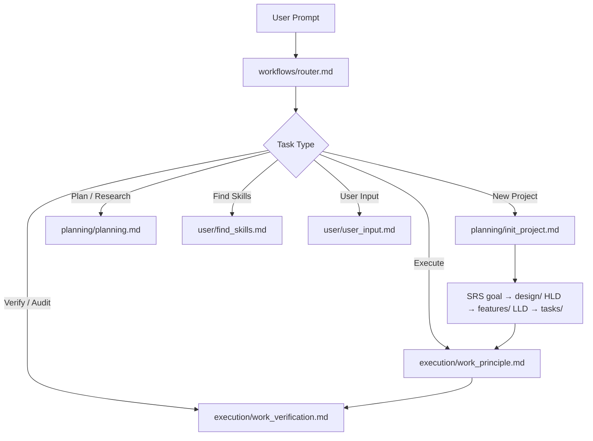

<div align="center">

# 🤖 Agent Buildable Base

**An opinionated, stack-agnostic scaffold for building autonomous software systems with AI agents.**

Turn a raw idea into a designed, executed, and verified system — without the agent drifting, duplicating, or shipping unverified code.

[](LICENSE)
[](VERSION)
[](https://github.com/AkshatTilak/agent_buildable_base/pulls)
[](https://github.com/AkshatTilak/agent_buildable_base/issues)

</div>

---

## What is Agent Buildable Base?

Agent Buildable Base is a **modular workspace framework** that lets an AI agent autonomously architect, execute, and verify complete software systems from a raw user idea. It is **stack-agnostic** — the stack, tooling, OS, and shell are detected or asked at init time and recorded in `STACK.md`.

The core idea: instead of a monolithic system prompt, the agent is guided by a **routing workflow** (`workflows/router.md`) that classifies every request and dispatches it to the right workflow — planning, execution, verification, or skill discovery. Every artifact is versioned, every task is verified, and every skill is reusable.

## Why Agent Buildable Base?

- **Requirements before design, design before code.** The goal file is a versioned **SRS** (`tasks/goal/goal.md`) with stable requirement IDs; the **DDS** (`design/` HLD + `features/` LLD specs) follows; tasks (`tasks/`) come last — never the other way around.
- **Traceable change.** Every task carries `srs_refs` to the requirements it satisfies, so a goal change triggers structured impact analysis and task restructuring (`workflows/planning/extend_goal.md`).
- **Contextual memory bank.** `references/` decouples long-lived knowledge from the agent's context window, preventing pollution and drift.
- **Two-track verification.** Every task must pass both unit tests *and* real system interaction before it's marked done (`workflows/execution/work_verification.md`).
- **Reusable skill library.** `skills/` holds folder-per-skill capabilities (QA, UI, debugging, TDD, research) with a pull-adapt-delete import workflow.
- **Hard conventions.** snake_case, zero-state definitions, duplicate-name root-causing, and a strict fallback policy — enforced, not advisory.
- **Version everything.** Every file carries YAML frontmatter; the base version lives in `VERSION` and `CHANGELOG.md`.

## Quick Start

> This is a **base scaffold**, not a runtime. You use it by bootstrapping a project inside it.

```bash
# 1. Clone the base
git clone https://github.com/AkshatTilak/agent_buildable_base.git
cd agent_buildable_base

# 2. Start a new project (or onboard an existing codebase)
#    The agent reads workflows/router.md and routes to planning/init_project.md
```

The `init_project` workflow will:
1. **Detect or ask** your stack, tooling, OS, and shell → recorded in `STACK.md`.
2. **Author the SRS** → `tasks/goal/goal.md` (versioned requirements).
3. **Design the DDS** → HLD in `design/system/`, LLD in `design/workflows/` + `features/`.
4. **Decompose into tasks** → `tasks/` (goal SRS → base → sub) with `srs_refs` traceability.
5. **Execute and verify** each task before sign-off.

## How It Works



## Repository Structure

```text
├── agent.md                # Base Architect prompt — always loaded
├── README.md               # You are here
├── CHANGELOG.md            # Base-level changelog
├── VERSION                 # Base version (semver)
├── STACK.md                # Recorded stack, tooling, OS, shell for THIS project
├── USER_PREFERENCES.md     # Per-user preferences
├── CONVENTIONS.md          # snake_case, zero-state, duplicate-name, fallback rules
├── CODING_PHILOSOPHY.md    # How we write code
├── workflows/              # Routing + execution workflows
│   ├── router.md           # Routes prompts to the best workflow (checked FIRST)
│   ├── execution/          # work_principle, work_verification
│   ├── planning/           # planning, init_project, extend_goal, extend_task
│   ├── quality/            # recheck_codebase, fallback_policy
│   ├── user/               # user_input, find_skills
│   └── ci/                 # setup_ci
├── design/                 # System, workflow, and UX designs
├── features/               # Feature specs with mermaid diagrams
├── references/             # Contextual memory bank for agents
│   ├── code/  deployment/  issues/  logic/  resource/
│   ├── structure/  user/  tests/  logs/  db/  tooling/
├── tasks/                  # Active execution directory
│   ├── goal/  base/  sub/  temp/  _templates/
├── skills/                 # Reusable job skills (tracked)
│   ├── skills.md           # Skills index
│   ├── manage_skills.md    # CRUD + pull-adapt-delete import
│   ├── qa/  ui/  debug/  practice/  research/  backend/
└── assets/                 # User-provided test inputs (gitignored)
```

## Skills Library

The `skills/` directory holds reusable, folder-per-skill capabilities. Each skill is a `SKILL.md` (metadata + instructions) plus an optional `scripts/` folder.

| Domain | Skills |
|--------|--------|
| **QA** | backend, frontend, docker, network, e2e |
| **UI** | creation, frontend_design |
| **Debug** | traceback |
| **Practice** | tdd, systematic_debugging, code_review, verification_before_completion |
| **Research** | web_research |
| **Backend** | api_design, domain_modeling |

New skills are imported via a **pull-adapt-delete** workflow: pull the source into `skills/_staging/`, adapt it to our format, then delete the staged copy.

## Conventions

- **snake_case** everywhere — files, folders, identifiers.
- **Zero-state convention** — every structure defines empty, populated, and errored states.
- **Duplicate-name root-causing** — unify divergent names at the source, never add aliases.
- **Fallback is not a default** — no blanket `try/except`; fallbacks only when the user requests them.
- **Two-track testing** — unit + real system interaction, both mandatory.

## Contributing

Contributions are welcome! Please:

1. Follow the conventions in `CONVENTIONS.md` and `CODING_PHILOSOPHY.md`.
2. Bump versions and update `CHANGELOG.md` for every change.
3. Verify your work against `workflows/execution/work_verification.md`.

## License

[MIT](LICENSE) © 2026 Akshat Tilak
