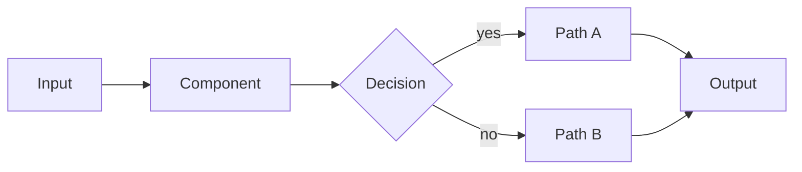

# Feature: <Feature Name>

## Overview
What this feature does, in plain terms. This spec is the feature's **LLD**
(component logic, APIs, data structures) within the DDS — see
`../../design/design.md` §2.

## SRS Traceability
Which SRS requirements (`FR-###` / `NFR-###` / `IR-###` in
`../../tasks/goal/goal.md`) this feature implements.

## Mermaid Diagram
Full connections and paths this feature considers.

## Connections
- **Upstream**: what feeds this feature.
- **Downstream**: what this feature feeds.
- **Data stores**: tables/schemas touched (see `../../references/db/`).
- **Other features**: related features and how they interact.

## States
- **Empty / zero state**: what it looks like when newly initialized or empty.
- **Populated state**: what it looks like with real value.
- **Errored state**: what it looks like on failure. *(Fallback only if the user
  requested one — see `../../workflows/quality/fallback_policy.md`.)*

## Caveats
- Known limitations, edge cases, and trade-offs.

## Backward Compatibility
- Does a change preserve backward compatibility? This is a **user choice** —
  record the decision here (see `../../workflows/user/user_input.md`).

## Changelog
- See `CHANGELOG.md` in this folder.
