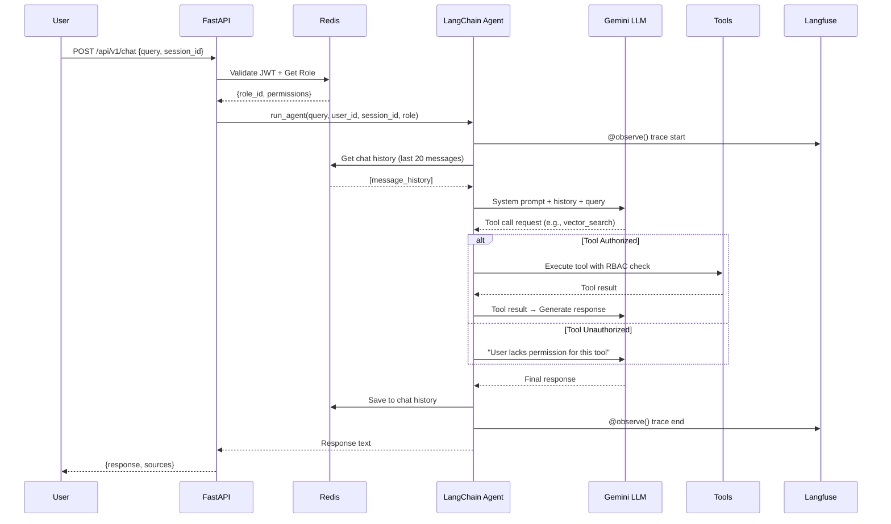

# Agent Orchestration Flow — EchoMind Core

## Request Lifecycle

## Tool Selection Logic

The LLM determines which tool to invoke based on:
1. **Tool docstrings** — Each @tool function has a descriptive docstring
2. **System prompt** — Includes instructions on when to use each tool
3. **User role** — Only tools the user is authorized for are loaded

## Available Tools

| Tool | Function | Gate |
|---|---|---|
| `vector_similarity_search` | pgvector cosine search on user documents | All roles |
| `ragflow_retrieve` | RAGFlow deep document retrieval | All roles |
| `query_user_analytics` | PySpark-computed user analytics | premium, admin |
