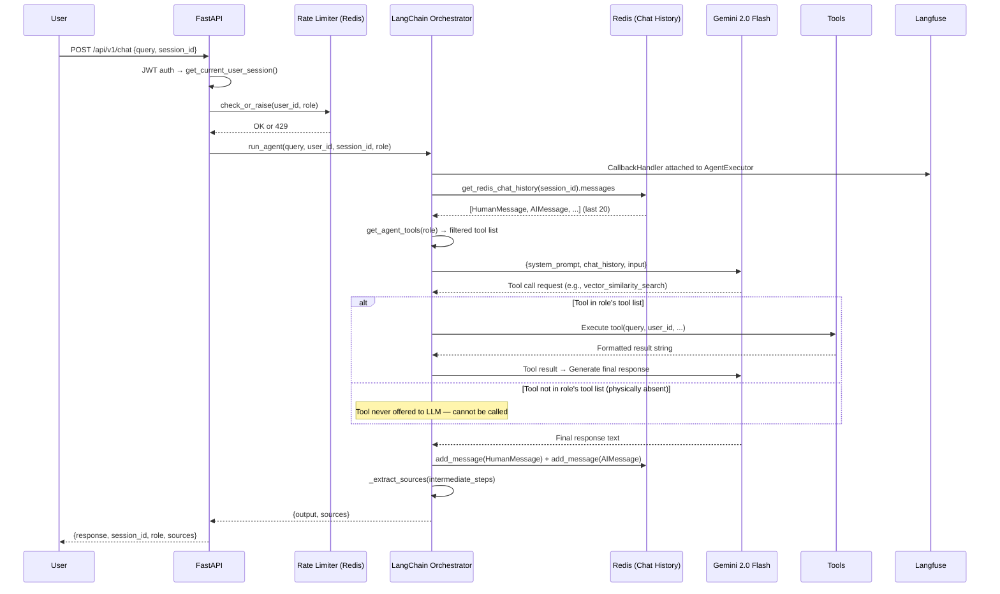

# Agent Orchestration Flow — EchoMind Core

**Updated:** 2026-07-14 | **Status:** BT04 COMPLETE

## Request Lifecycle



## RBAC Tool Gating Strategy

Tool access is enforced by **physically excluding unauthorized tools from the AgentExecutor**.
The LLM only sees tools it is given — it cannot call a tool that isn't in its context.

```python
# orchestrator.py — get_agent_tools()
_BASE_TOOLS    = [vector_similarity_search, ragflow_retrieve]
_PREMIUM_TOOLS = [*_BASE_TOOLS, query_user_analytics]
_ADMIN_TOOLS   = [*_PREMIUM_TOOLS]
```

| Role | Tools Available |
|---|---|
| `standard` | `vector_similarity_search`, `ragflow_retrieve` |
| `premium` | All standard + `query_user_analytics` |
| `admin` | All premium (extend for diagnostics in future) |

## Available Tools (BT04 Complete)

| Tool | Module | Gate | Description |
|---|---|---|---|
| `vector_similarity_search` | `app.agent.tools.vector_search` | All roles | pgvector HNSW cosine search (3072-dim Gemini embeddings) |
| `ragflow_retrieve` | `app.agent.tools.ragflow_retrieval` | All roles | RAGFlow DeepDoc OCR retrieval |
| `query_user_analytics` | `app.agent.tools.user_analytics` | premium, admin | PySpark-computed interaction analytics |

## Prompt Template Structure

The system prompt is a `ChatPromptTemplate` (NOT a plain string):

```python
ChatPromptTemplate.from_messages([
    ("system", _SYSTEM_INSTRUCTIONS),
    MessagesPlaceholder("chat_history"),   # ← injected from Redis
    ("human", "{input}"),
    MessagesPlaceholder("agent_scratchpad"), # ← filled by agent during reasoning
])
```

## Observability

- Langfuse `CallbackHandler` attached to `AgentExecutor(callbacks=[langfuse_cb])`
- One `CallbackHandler` per request, keyed by `user_id` + `session_id`
- Captures: LLM calls, tool invocations, token counts, latency
- Traces viewable at `http://localhost:3000` (Langfuse self-hosted)
- Langfuse client initialized at startup via `init_langfuse()` in `app.main`

## Source Extraction

`_extract_sources(intermediate_steps)` scans `(AgentAction, tool_output)` tuples:
- Looks for `"File: "` or `"Document: "` prefixes in tool output strings
- Deduplicates and returns as `sources: list[str]` in `ChatResponse`
