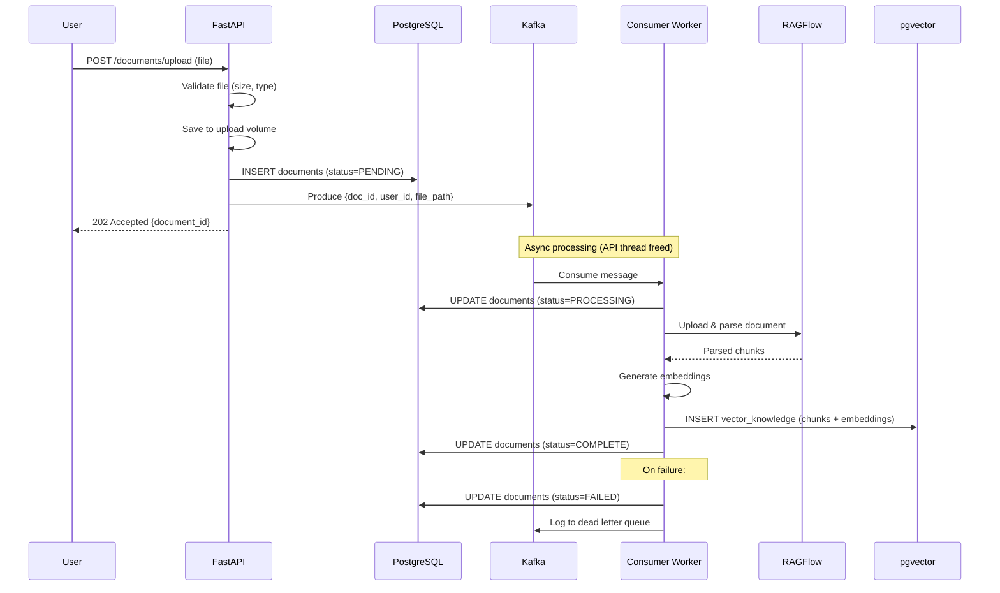

# Kafka Document Ingestion Pipeline — EchoMind Core

## Pipeline Flow



## Kafka Configuration

- **Topic**: `document.ingestion.events`
- **Consumer Group**: `document-processor`
- **Auto Offset Reset**: `earliest`
- **Serialization**: JSON (UTF-8)

## Event Payload Schema

```json
{
    "document_id": "uuid",
    "user_id": "uuid",
    "file_path": "/uploads/user_uuid/filename.pdf",
    "action": "INGEST"
}
```

## Error Handling

1. **Transient failures** (network, timeout): Retry with exponential backoff
2. **Permanent failures** (corrupt file, parse error): Move to dead letter queue, set status=FAILED
3. **Kafka unavailable**: FastAPI returns 503 Service Unavailable
