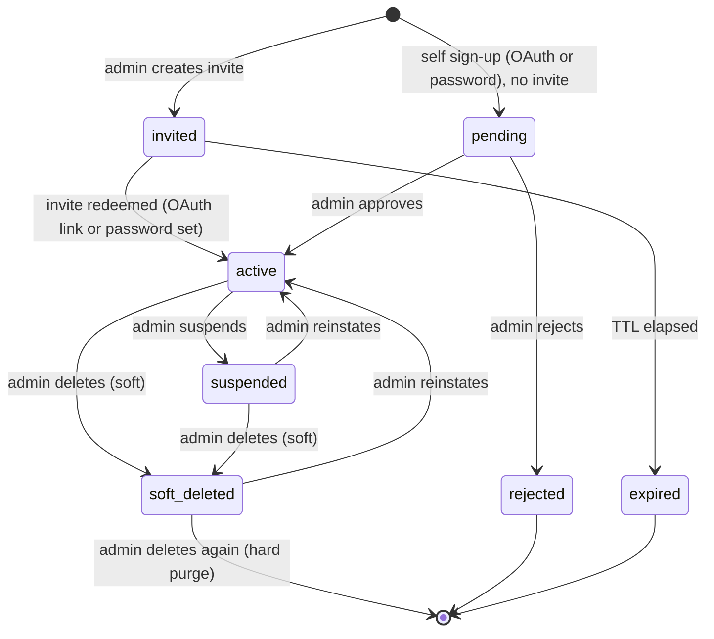

# User Management, Invitations & Approval Gate (V7)

> **Status:** Authoritative for V7
> **Owner modules:** `gateway/auth`, `gateway/api/admin_users.py`, `common/models`
> **Depends on:** [`references/logic/hubs.md`](file:///c:/Akshat/ContAIned/agent_buildable_base/references/logic/hubs.md) §4

V5 supported Google/GitHub OAuth only, with a global `admin/editor/viewer` role and no way for an
administrator to provision a user ahead of time. V6 introduced three linked capabilities; V7 adds
soft deletion and hard purge:

1. **Admin-issued invitations** with a pre-assigned platform role and pre-assigned hub memberships.
2. **Local email + password authentication** alongside the existing OAuth providers.
3. An **approval gate**: any user who self-registers (via OAuth or password signup) without a matching
   invite lands in a `pending` state and cannot access anything until a platform admin approves them.
4. **Soft deletion with hard purge**: users are soft-deleted by default; an explicit `hard=true` query
   parameter (or deleting an already-soft-deleted user) permanently removes the record.

---

## 1. Account Lifecycle



`users.status` ∈ `pending | active | suspended | rejected`. The `is_active` boolean from V5 is
**dropped** and replaced by this enum.

**Soft-deletion flags (V7):**
* `users.is_deleted` — boolean flag, default `false`.
* `users.deleted_at` — timestamp set at soft-delete time.

A soft-deleted user cannot log in, is filtered from normal admin/user listings, and has all sessions
revoked immediately. Hard purge is only allowed when the user owns no active hubs; otherwise the API
returns `409` with the list of owned hubs.

**Access rule:** only `status = "active"` users receive a usable session token. Any other status
returns `403` with a machine-readable `reason` (`ACCOUNT_PENDING_APPROVAL`, `ACCOUNT_SUSPENDED`,
`ACCOUNT_REJECTED`) so the frontend can render the correct holding screen instead of a generic error.

---

## 2. Data Model Changes

### 2.1 `users` (modified)

```text
users
  id                    String(36) PK
  email                 String(255) unique, indexed, lowercased on write
  display_name          String(100) nullable
  avatar_url            String(500) nullable
  platform_role         String(20)  not null default "member"   # admin | member   (replaces `role`)
  status                String(20)  not null default "pending"  # replaces `is_active`
  password_hash         String(255) nullable                    # argon2id; null = SSO-only account
  password_updated_at   DateTime    nullable
  approved_by           String(36)  FK users.id nullable
  approved_at           DateTime    nullable
  failed_login_count    Integer     default 0
  locked_until          DateTime    nullable
  is_deleted            Boolean     default false, indexed
  deleted_at            DateTime    nullable
  created_at            DateTime
  last_login            DateTime    nullable
```

**Removed:** `role`, `is_active`, `provider`, `provider_id` (single-provider assumption).
**Added in V7:** `is_deleted`, `deleted_at`.

### 2.2 `user_identities` (new) — multi-provider linking

A user may sign in with Google **and** GitHub **and** a password, all resolving to one account keyed by
verified email.

```text
user_identities
  id            String(36) PK
  user_id       String(36) FK users.id ON DELETE CASCADE, indexed
  provider      String(20) not null      # google | github | password
  provider_id   String(255) not null     # subject claim; equals user_id for `password`
  email         String(255) not null
  created_at    DateTime
  last_used_at  DateTime nullable

  UNIQUE (provider, provider_id)
```

### 2.3 `user_invites` (new)

```text
user_invites
  id                  String(36) PK
  email               String(255) not null, indexed, lowercased
  token_hash          String(255) not null, indexed     # sha256 of the raw token; raw never stored
  platform_role       String(20)  not null default "member"
  hub_grants_json     JSON        default []            # [{"hub_id": "...", "hub_role": "contributor"}]
  invited_by          String(36)  FK users.id
  status              String(20)  not null default "pending"   # pending | accepted | revoked | expired
  expires_at          DateTime    not null
  accepted_at         DateTime    nullable
  accepted_user_id    String(36)  FK users.id nullable
  resend_count        Integer     default 0
  last_sent_at        DateTime    nullable
  created_at          DateTime

  UNIQUE (email) WHERE status = 'pending'   -- partial index; one open invite per address
```

Token rules:
* Raw token = `secrets.token_urlsafe(32)`. Only its SHA-256 hash is persisted.
* Default TTL `INVITE_TTL_HOURS` (default `72`).
* Redeeming is idempotent-safe: a second redemption of an `accepted` token returns `409`.
* Lookup is by `token_hash` only; comparison uses `hmac.compare_digest`.

---

## 3. Authentication Flows

### 3.1 OAuth sign-in (Google / GitHub)

1. `GET /auth/login/{provider}` → redirect with PKCE + signed `state`.
2. `GET /auth/callback` → exchange code, fetch profile, require a **verified** email.
3. Resolve identity:
   * `user_identities` row matches → load that user.
   * No identity, but a user exists with the same email → **link** a new `user_identities` row to it.
   * No user at all → look for a `pending` invite matching the email:
     * Invite found → create user with the invite's `platform_role`, apply `hub_grants_json`,
       set `status = "active"`, mark invite `accepted`.
     * No invite → create user with `platform_role = "member"`, `status = "pending"`.
4. Issue a session only if `status = "active"`; otherwise return the holding-screen reason.

### 3.2 Password sign-in

* `POST /auth/register` — email + password. Same invite/pending branch as step 3 above.
* `POST /auth/login` — verify Argon2id hash.
* `POST /auth/forgot-password` / `POST /auth/reset-password` — single-use, 1-hour, SHA-256-hashed token
  delivered by email; reuses the same delivery layer as invites.
* `POST /auth/change-password` — requires the current password; revokes all other sessions.

**Password policy:** minimum 12 characters, checked against a common-password denylist, hashed with
Argon2id (`time_cost=3, memory_cost=65536, parallelism=4`). Never logged, never echoed.

**Brute-force protection:** `failed_login_count` increments on failure; at `5` the account is locked via
`locked_until = now + 15min`. Login responses are constant-time and identical for "unknown email" and
"wrong password" to prevent account enumeration.

### 3.3 Invite redemption

`GET /auth/invite/{token}` returns the invite preview (email, inviter, role, hub names) without
creating anything. The frontend then offers both paths:

* **Continue with Google / GitHub** — OAuth flow carrying the invite token in signed state. The
  provider email **must** match the invite email, otherwise `409 Invite email mismatch`.
* **Set a password** — `POST /auth/invite/{token}/accept` with a password.

Either path creates an `active` user, writes `user_identities`, applies `hub_grants_json`, marks the
invite `accepted`, and writes an `audit_log` row.

---

## 4. Admin Console API

All routes require platform `admin`. Prefix `/admin`.

| Method | Path | Purpose |
|---|---|---|
| `GET` | `/admin/users` | Paginated, filterable by `status`, `platform_role`, `hub_id`, free-text `q` |
| `GET` | `/admin/users/{id}` | Detail including identities, hub memberships, recent audit entries |
| `PATCH` | `/admin/users/{id}` | Update `display_name`, `platform_role` |
| `POST` | `/admin/users/{id}/approve` | `pending` → `active`; optionally set role and hub grants in one call |
| `POST` | `/admin/users/{id}/reject` | `pending` → `rejected`, with an optional reason emailed to the user |
| `POST` | `/admin/users/{id}/suspend` | `active` → `suspended`; revokes all sessions immediately |
| `POST` | `/admin/users/{id}/reinstate` | `suspended` → `active` |
| `DELETE` | `/admin/users/{id}` | Soft delete by default; `?hard=true` hard purges. Blocked (`409`) if the user owns active hubs |
| `GET` | `/admin/users/pending` | Approval queue (badge count source) |
| `POST` | `/admin/invites` | Create invite(s); accepts a list of emails for bulk invite |
| `GET` | `/admin/invites` | List with status filter |
| `POST` | `/admin/invites/{id}/resend` | Re-send; rate-limited to 3 per invite per hour |
| `DELETE` | `/admin/invites/{id}` | Revoke |
| `GET` | `/admin/audit` | Audit log, filterable by actor, hub, resource type, date range |

**Guardrails enforced server-side:**
* An admin may not demote, suspend, or delete their **own** account.
* The system refuses any action that would leave zero `active` platform admins.
* Deleting a user who owns a hub requires transferring ownership first.

---

## 5. Email Delivery

`gateway/services/mailer.py` provides a small abstraction:

```python
class Mailer(Protocol):
    async def send(self, to: str, subject: str, html: str, text: str) -> bool: ...

class SMTPMailer(Mailer): ...      # aiosmtplib, STARTTLS/SSL
class NullMailer(Mailer): ...      # logs and returns False when SMTP is unconfigured
```

Templates live in `gateway/templates/email/`: `invite.html`, `approved.html`, `rejected.html`,
`password_reset.html`. Each ships a plain-text counterpart.

**Graceful fallback:** if SMTP is not configured (or a send fails), the API still succeeds and returns
`{"delivered": false, "invite_url": "https://.../auth/invite/<token>"}`. The admin UI then surfaces a
prominent **Copy invite link** control with a warning banner. This is the only situation in which the
raw token is returned, and it is returned only to the creating admin, only once.

### Environment variables (add to `.env.example` and `common/config/settings.py`)

```text
SMTP_HOST=
SMTP_PORT=587
SMTP_USER=
SMTP_PASSWORD=
SMTP_FROM=ContAIned <no-reply@contained.local>
SMTP_USE_TLS=true
INVITE_TTL_HOURS=72
PASSWORD_RESET_TTL_MINUTES=60
APP_PUBLIC_URL=http://localhost:5173
ALLOW_SELF_REGISTRATION=true
ALLOW_MEMBER_HUB_CREATION=true
AUTO_APPROVE_EMAIL_DOMAINS=          # optional CSV, e.g. "acme.com" -> skip approval gate
DATASTORE_ENCRYPTION_KEY=            # Fernet key, also used for invite/credential encryption
```

---

## 6. Frontend Surfaces

| Route | Component | Notes |
|---|---|---|
| `/admin/users` | `admin/UserDirectory.tsx` | Table with status chips, role selector, row actions, bulk select |
| `/admin/users/pending` | `admin/ApprovalQueue.tsx` | Approve/reject with inline role + hub grant assignment |
| `/admin/invites` | `admin/InviteManager.tsx` | Create (single + bulk paste), resend, revoke, copy-link fallback |
| `/admin/audit` | `admin/AuditLogViewer.tsx` | Virtualised, filterable, expandable before/after diff |
| `/auth/invite/:token` | `auth/InviteAccept.tsx` | Preview + dual OAuth/password acceptance |
| `/auth/pending` | `auth/PendingApproval.tsx` | Holding screen with polling + "contact admin" affordance |
| `/auth/register` | `auth/RegisterPage.tsx` | Password sign-up with live strength meter |
| `/auth/reset-password/:token` | `auth/ResetPassword.tsx` | |

A **pending-approval badge** on the Admin sidebar item shows the live count from
`GET /admin/users/pending`, polled every 60s and invalidated on approval actions.

---

## 7. Security Requirements

* Argon2id for passwords; never bcrypt/MD5/SHA alone.
* Invite and reset tokens: 256-bit entropy, stored hashed, single-use, TTL-bound, compared with
  `hmac.compare_digest`.
* Constant-time, non-enumerating responses on `/auth/login`, `/auth/forgot-password`, and
  `/auth/register`.
* Rate limits: `/auth/login` 10/min per IP, `/auth/register` 5/hour per IP,
  `/auth/forgot-password` 3/hour per email, `/admin/invites` 60/hour per admin.
* Session revocation on password change, suspension, rejection, and role demotion.
* All admin mutations write an `audit_log` row including actor, IP, and before/after state.
* Email addresses are normalised (trimmed + lowercased) before any comparison or storage.
* Invite `hub_grants_json` is validated against real hub ids at creation **and** at redemption.
