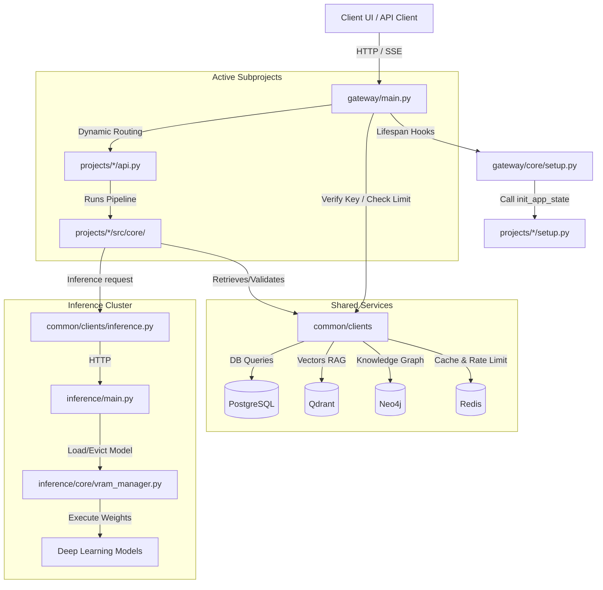

# Repository Layout & System Navigation Guide

This document provides a comprehensive overview of the `contained-ai-platform` monorepo structure, detailing what each directory does, key files, and how to navigate the codebase as an agent or developer.

---

## 1. Monorepo Directory Tree

Here is the high-level layout of the workspace:

```text
contained/                  <-- Monorepo Root
├── .env.example            <-- Template for system-wide configuration
├── pyproject.toml          <-- Central Poetry configuration (packages, dependencies, extras)
├── alembic.ini             <-- Alembic migration configuration
├── common/                 <-- Shared Python modules and base classes
│   ├── clients/            <-- Shared database and service clients
│   ├── config/             <-- Shared configuration loader (Pydantic settings)
│   ├── models/             <-- Model registry, database schemas, and migration hooks
│   ├── schemas/            <-- Platform-wide API schemas and definitions
│   └── observability/      <-- Central OpenTelemetry, logger, and rate-limiter setup
├── gateway/                <-- CPU-only FastAPI API Gateway
│   ├── api/                <-- Gateway routes & health check endpoints
│   ├── core/               <-- App initialization & project lifecycles (setup.py)
│   └── main.py             <-- API Gateway entry point
├── inference/              <-- Dedicated model loading & inference server (GPU/CPU)
│   ├── core/               <-- Model loader, downloader, & VRAM Manager
│   ├── models/             <-- Individual model run wrappers (ASR, OCR, embed, classifier)
│   ├── routes/             <-- Inference endpoints (FastAPI)
│   └── main.py             <-- Inference Server entry point
├── projects/               <-- Modular, plug-and-play platform projects
│   ├── syntraflow/         <-- Ingestion and hybrid Graph/Vector RAG pipeline
│   ├── guardroute/         <-- Multi-agent orchestrator, guardrails, and secure chat
│   └── evalops/            <-- Observability, safety logs, and RAGAS metrics
│       └── [project]/      <-- Project-specific layout
│           ├── api.py      <-- Project-specific API endpoints (mounted by gateway)
│           ├── setup.py    <-- Startup & shutdown hooks (called by gateway lifecycle)
│           ├── src/        <-- Core project logic (agents, core workflows, database, utils)
│           ├── tests/      <-- Pytest unit and integration tests
│           └── pyproject.toml <-- Project metadata
├── infrastructure/         <-- Containerization & service composition
│   ├── Dockerfile.gateway  <-- Dockerfile for API Gateway
│   ├── Dockerfile.inference <-- Dockerfile for Inference Server
│   └── docker-compose.yml  <-- Multi-container configuration for backing databases and services
├── migrations/             <-- Database schema evolution (Alembic)
│   └── versions/           <-- Database migration scripts
└── agent_buildable_base/   <-- Reference documentation and task guidelines (Metadata)
    ├── prompts/            <-- Base prompt templates
    ├── references/         <-- System specifications (this directory)
    └── tasks/              <-- Versioned task database (v1/, v2/, etc. for base/sub tasks)
```

---

## 2. Directory Breakdowns & Component Responsibilities

### Root Configuration
* **Location:** `c:\Akshat\ContAIned\`
* **Key Files:**
  * [`pyproject.toml`](file:///c:/Akshat/ContAIned/pyproject.toml): Configures the monorepo using Poetry. Defines shared base dependencies (FastAPI, SQLAlchemy, etc.) and project-specific extras (`syntraflow`, `guardroute`, `inference`, `evalops`).
  * [`.env.example`](file:///c:/Akshat/ContAIned/.env.example): Contains templates for database connections, AI keys (Gemini, OpenAI, Cerebras), active submodules (`ACTIVE_PROJECTS`), and model choices.
  * [`alembic.ini`](file:///c:/Akshat/ContAIned/alembic.ini): Configures database migrations using SQLAlchemy.
* **Responsibilities:** System bootstrap settings, developer tooling, and global dependencies definition.

### `common/` (Shared Base Library)
* **Location:** [common/](file:///c:/Akshat/ContAIned/common)
* **Responsibilities:** Provides centralized utilities, DB connection pools, configuration parsing, logging, and models so subprojects do not reinvent the wheel or open duplicate connection pools.
* **Main Subfolders:**
  * [`clients/`](file:///c:/Akshat/ContAIned/common/clients/): Connectors for databases and external/internal services:
    * `postgres.py`: Shared SQLAlchemy engine/sessionmaker (async).
    * `qdrant.py`: Qdrant vector database helper. Resolves dimension based on embedding model.
    * `neo4j.py`: Graph database connector with Cypher validation.
    * `redis.py`: Key-value cache and rate limit backend.
    * `inference.py`: Custom `InferenceClient` that sends CPU-only gateway requests to the Inference Server.
    * `litellm.py`: Provider client wrapper for cloud LLMs using LiteLLM.
  * [`config/`](file:///c:/Akshat/ContAIned/common/config/): Defines the central settings parser (`settings.py`) using Pydantic Settings.
  * [`models/`](file:///c:/Akshat/ContAIned/common/models/): Standardized models:
    * `database.py`: SQL database models (API keys, audit logs, model hub states).
    * `registry.py`: Logic to resolve/seed supported model roles and VRAM specs.
  * [`observability/`](file:///c:/Akshat/ContAIned/common/observability/): Custom JSON logging (`logger.py`), API rate limit middleware (`limiter.py`), and OpenTelemetry hook points.
  * [`schemas/`](file:///c:/Akshat/ContAIned/common/schemas/): Shared Pydantic data schemas.

### `gateway/` (FastAPI API Gateway)
* **Location:** [gateway/](file:///c:/Akshat/ContAIned/gateway)
* **Responsibilities:** Serves as the primary public API entry point. It runs on CPU-only. It dynamically mounts subprojects based on configuration and acts as the gatekeeper for authentication, rate-limiting, and request sizing.
* **Main Subfolders & Files:**
  * [`main.py`](file:///c:/Akshat/ContAIned/gateway/main.py): Gateway entry point. Configures CORS, sets up OpenTelemetry, attaches rate limiters, and starts Uvicorn.
  * [`core/setup.py`](file:///c:/Akshat/ContAIned/gateway/core/setup.py): Lifecycle hooks executor. On startup, verifies DB connections, runs Alembic migrations, seeds default API keys/model states, and calls `init_app_state()` for active subprojects.
  * [`api/__init__.py`](file:///c:/Akshat/ContAIned/gateway/api/__init__.py): Dynamic routing engine. Loops over `ACTIVE_PROJECTS`, loads their `api.py` routers, and mounts them under `/api/{project}`.

### `inference/` (Dedicated Deep Learning Server)
* **Location:** [inference/](file:///c:/Akshat/ContAIned/inference)
* **Responsibilities:** Isolated ML server that holds GPU/CUDA contexts, loads heavy models (Whisper/SenseVoice, Baidu OCR, Jina CLIP, Arch Classifier), and schedules VRAM allocation dynamically.
* **Main Subfolders & Files:**
  * [`main.py`](file:///c:/Akshat/ContAIned/inference/main.py): Entry point for the inference service.
  * [`core/vram_manager.py`](file:///c:/Akshat/ContAIned/inference/core/vram_manager.py): Allocates/evicts loaded models dynamically to remain under the configured VRAM budget.
  * [`core/downloader.py`](file:///c:/Akshat/ContAIned/inference/core/downloader.py): Handles local HF model downloads, quantization setups, and cache checks.
  * [`models/`](file:///c:/Akshat/ContAIned/inference/models/): Wrappers mapping execution routines:
    * `sensevoice.py` (ASR), `baidu_ocr.py` / `glm_ocr.py` (OCR), `jina_clip.py` (embeddings), and `classifier.py` (routing).
  * [`routes/`](file:///c:/Akshat/ContAIned/inference/routes/): Individual API endpoints exposing ML capabilities to the Gateway.

### `projects/` (Modular Plug-and-Play Applications)
* **Location:** [projects/](file:///c:/Akshat/ContAIned/projects)
* **Responsibilities:** Contains all product subprojects. Each folder operates like a standalone app with its own router and startup requirements, but leverages the parent repository's virtual environment and shared libraries.
* **Main Subprojects:**
  1. [`syntraflow/`](file:///c:/Akshat/ContAIned/projects/syntraflow/): Ingestion pipeline. Extracts layouts from documents, converts video to transcripts, index text chunks into Qdrant (vector) and Neo4j (graph).
  2. [`guardroute/`](file:///c:/Akshat/ContAIned/projects/guardroute/): Chat and security orchestration. Implements LangGraph chat sessions, input/output validation, sandbox code execution, and safe LLM fallbacks.
  3. [`evalops/`](file:///c:/Akshat/ContAIned/projects/evalops/): Diagnostic dashboard. Collects traces, runs DeepEval/RAGAS evaluation benchmarks, logs system safety, and runs local model performance comparative metrics.
* **Standard Internal Layout:**
  * `api.py`: FastAPI routes (e.g. `router = APIRouter()`) that are dynamically loaded by the gateway.
  * `setup.py`: Lifespan hooks (e.g. `init_app_state`, `shutdown_app_state`) to register background loops (like Kafka worker threads) and configure local connections.
  * `src/agents/`: Subagents, prompt parameters, and execution state graphs (such as LangGraph charts).
  * `src/core/`: Primary feature algorithms and service classes.
  * `src/database/`: Project-specific schema tables or query helper hooks.
  * `tests/`: Automated unit and integration test suits for the project.

### `infrastructure/` (DevOps & Environment Composition)
* **Location:** [infrastructure/](file:///c:/Akshat/ContAIned/infrastructure)
* **Responsibilities:** Contains instructions to package, network, and orchestrate the backing databases and microservices.
* **Key Files:**
  * [`docker-compose.yml`](file:///c:/Akshat/ContAIned/infrastructure/docker-compose.yml): Configures backing storage containers (Postgres, Neo4j, Redis, Qdrant, Kafka) and server profiles (`admin` for tools like pgAdmin/Kafka-UI; `observability` for Jaeger tracing).
  * [`Dockerfile.gateway`](file:///c:/Akshat/ContAIned/infrastructure/Dockerfile.gateway) / [`Dockerfile.inference`](file:///c:/Akshat/ContAIned/infrastructure/Dockerfile.inference): Platform image descriptions.

---

## 3. Communication & Integration Patterns

Understanding how these directories relate to one another is key to navigating the repository:



---

## 4. Navigation & Development Tips

### Where should I write new code?
* **Adding a shared connector, schema, or model:** Edit [`common/`](file:///c:/Akshat/ContAIned/common).
* **Adding database tables:** Add the SQL models to [`common/models/database.py`](file:///c:/Akshat/ContAIned/common/models/database.py) and use Alembic commands to generate a migration script in [`migrations/versions/`](file:///c:/Akshat/ContAIned/migrations/versions/).
* **Adding new routes or business logic for a feature:** Focus entirely on the project directory under [`projects/`](file:///c:/Akshat/ContAIned/projects) (e.g. `projects/syntraflow`). Modify its `api.py` to add routes, and place implementation routines in `src/core/`.
* **Adding a model execution wrapper:** Add the Python wrapper file under [`inference/models/`](file:///c:/Akshat/ContAIned/inference/models/) and add its routing trigger in [`inference/routes/`](file:///c:/Akshat/ContAIned/inference/routes/).

### How does configuration cascade?
1. The developer configures environments in `.env` (like `ACTIVE_PROJECTS`, `DATABASE_URL`).
2. Pydantic settings in [`common/config/settings.py`](file:///c:/Akshat/ContAIned/common/config/settings.py) read and validate these variables.
3. The Gateway and Inference servers load this shared class to verify connections, endpoints, and credentials.

### Database Namespacing Rules
All submodules share the same PostgreSQL database, Neo4j instances, and Qdrant clusters. To prevent collision:
* **SQL database tables** must use submodule prefixes: `syntraflow_`, `guardroute_`, `evalops_`, `model_registry_`.
* **Neo4j Node labels** must use project prefixes: `SyntraFlow_Entity`, `SyntraFlow_Relation`.
* **Qdrant Vector collection names** must use project prefixes: `syntraflow_chunks_v1`.
