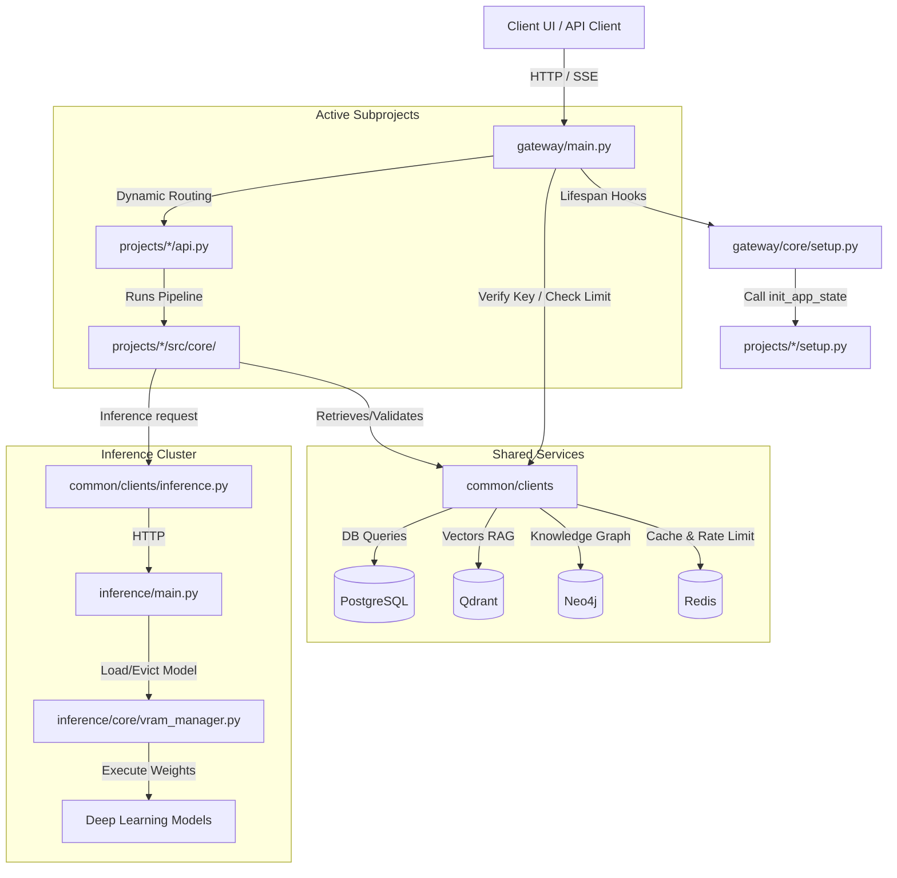

# Repository Layout & System Navigation Guide

This document provides a comprehensive overview of the `contained-ai-platform` monorepo structure, detailing what each directory does, key files, and how to navigate the codebase as an agent or developer.

> **V6:** the layout below includes the Hub tenancy modules. See
> [`references/logic/hubs.md`](file:///c:/Akshat/ContAIned/agent_buildable_base/references/logic/hubs.md)
> for the tenancy model itself and §5 of this document for what V6 adds and removes.

---

## 1. Monorepo Directory Tree

Here is the high-level layout of the workspace:

```text
contained/                  <-- Monorepo Root
├── .env.example            <-- Template for system-wide configuration
├── pyproject.toml          <-- Central Poetry configuration (packages, dependencies, extras)
├── alembic.ini             <-- Alembic migration configuration
├── common/                 <-- Shared Python modules and base classes
│   ├── clients/            <-- Shared database and service clients
│   ├── config/             <-- Shared configuration loader (Pydantic settings)
│   ├── models/             <-- Model registry, database schemas, and migration hooks
│   ├── schemas/            <-- Platform-wide API schemas and definitions
│   │   └── hubs.py         <-- V6: Hub, HubMember, HubLink, DatastoreBinding contracts
│   ├── services/           <-- Shared domain services
│   │   ├── hub_repository.py  <-- V6: hub CRUD, membership and link persistence
│   │   └── hub_resolver.py    <-- V6: cross-hub reference resolution + link enforcement
│   └── observability/      <-- Central OpenTelemetry, logger, and rate-limiter setup
├── gateway/                <-- CPU-only FastAPI API Gateway
│   ├── api/                <-- Gateway routes & health check endpoints
│   │   ├── hubs.py         <-- V6: /hubs CRUD, members, links, datastore bindings
│   │   ├── admin_users.py  <-- V6: /admin users, approvals, invites, audit log
│   │   └── workflows.py    <-- V6: /hubs/{hub_id}/workflows, versions, runs
│   ├── auth/               <-- Authentication, authorisation and session handling
│   │   ├── hub_context.py  <-- V6: HubContext + require_hub() dependency factory
│   │   └── invites.py      <-- V6: invite token issue / preview / redeem
│   ├── services/
│   │   └── mailer.py       <-- V6: SMTPMailer / NullMailer abstraction
│   ├── templates/email/    <-- V6: invite, approved, rejected, password_reset (html + text)
│   ├── core/               <-- App initialization & project lifecycles (setup.py)
│   └── main.py             <-- API Gateway entry point
├── inference/              <-- Dedicated model loading & inference server (GPU/CPU)
│   ├── core/               <-- Model loader, downloader, & VRAM Manager
│   ├── models/             <-- Individual model run wrappers (ASR, OCR, embed, classifier)
│   ├── routes/             <-- Inference endpoints (FastAPI)
│   └── main.py             <-- Inference Server entry point
├── frontend/               <-- React 19 + TypeScript web client (Vite)
│   └── src/
│       ├── routes.ts       <-- V6: typed route builders + ROUTE_PATTERNS
│       ├── components/
│       │   ├── hubs/       <-- V6: HubShell, HubDirectory, HubCreateWizard,
│       │   │   │               MembersPanel, HubLinksPanel, HubContext, Gated
│       │   │   ├── ingestion/  <-- Collections, Datastores, Documents, Jobs workspaces
│       │   │   ├── agent/      <-- Agent library & agent detail workspace
│       │   │   ├── workflow/   <-- Workflow library, versioned editor, runs
│       │   │   └── eval/       <-- Suites, target picker, results, trace replay
│       │   ├── admin/      <-- V6: UserDirectory, ApprovalQueue, InviteManager, AuditLogViewer
│       │   ├── auth/       <-- Login, register, invite accept, pending approval, reset
│       │   ├── layout/     <-- Sidebar, Header, Breadcrumbs, CommandPalette
│       │   └── shared/     <-- DataTable, PageHeader, EmptyState, ErrorState, Drawer, …
│       ├── store/          <-- Zustand slices; V6 adds hubSlice.ts
│       ├── services/       <-- REST client (hub-scoped) and telemetry
│       └── hooks/          <-- useHubPermissions, useKeyboard, useDebounce
├── projects/               <-- Modular, plug-and-play platform projects
│   ├── syntraflow/         <-- Ingestion and hybrid Graph/Vector RAG pipeline
│   │   └── src/datastores/ <-- V6: per-hub datastore binding resolution & health checks
│   ├── guardroute/         <-- Multi-agent orchestrator, guardrails, and secure chat
│   │   └── src/workflows/  <-- V6: workflow versioning, run execution, node tracing
│   └── evalops/            <-- Observability, safety logs, and RAGAS metrics
│       ├── src/runner/dispatch.py  <-- V6: polymorphic agent|workflow target dispatch
│       └── [project]/      <-- Project-specific layout
│           ├── api.py      <-- Project-specific API endpoints (mounted by gateway)
│           ├── setup.py    <-- Startup & shutdown hooks (called by gateway lifecycle)
│           ├── src/        <-- Core project logic (agents, core workflows, database, utils)
│           ├── tests/      <-- Pytest unit and integration tests
│           └── pyproject.toml <-- Project metadata
├── infrastructure/         <-- Containerization & service composition
│   ├── Dockerfile.gateway  <-- Dockerfile for API Gateway
│   ├── Dockerfile.inference <-- Dockerfile for Inference Server
│   └── docker-compose.yml  <-- Multi-container configuration for backing databases and services
├── migrations/             <-- Database schema evolution (Alembic)
│   └── versions/           <-- Database migration scripts (V6 = stage 1 additive + stage 2 cutover)
├── scripts/                <-- Operational and verification tooling
│   ├── deploy.py
│   ├── migration_dryrun.py <-- V6: restore a V5 dump, run upgrade/downgrade, assert invariants
│   └── verify_v6_cutover.py<-- V6: fails CI if any removed symbol/route/column string survives
├── tests/                  <-- Cross-cutting platform test suite (incl. test_hub_isolation.py)
└── agent_buildable_base/   <-- Reference documentation and task guidelines (Metadata)
    ├── prompts/            <-- Base prompt templates
    ├── references/         <-- System specifications (this directory)
    └── tasks/              <-- Versioned task database (v1/, v2/, etc. for base/sub tasks)
```

---

## 2. Directory Breakdowns & Component Responsibilities

### Root Configuration
* **Location:** `c:\Akshat\ContAIned\`
* **Key Files:**
  * [`pyproject.toml`](file:///c:/Akshat/ContAIned/pyproject.toml): Configures the monorepo using Poetry. Defines shared base dependencies (FastAPI, SQLAlchemy, etc.) and project-specific extras (`syntraflow`, `guardroute`, `inference`, `evalops`).
  * [`.env.example`](file:///c:/Akshat/ContAIned/.env.example): Contains templates for database connections, AI keys (Gemini, OpenAI, Cerebras), active submodules (`ACTIVE_PROJECTS`), and model choices.
  * [`alembic.ini`](file:///c:/Akshat/ContAIned/alembic.ini): Configures database migrations using SQLAlchemy.
* **Responsibilities:** System bootstrap settings, developer tooling, and global dependencies definition.

### `common/` (Shared Base Library)
* **Location:** [common/](file:///c:/Akshat/ContAIned/common)
* **Responsibilities:** Provides centralized utilities, DB connection pools, configuration parsing, logging, and models so subprojects do not reinvent the wheel or open duplicate connection pools.
* **Main Subfolders:**
  * [`clients/`](file:///c:/Akshat/ContAIned/common/clients/): Connectors for databases and external/internal services:
    * `postgres.py`: Shared SQLAlchemy engine/sessionmaker (async).
    * `qdrant.py`: Qdrant vector database helper. Resolves dimension based on embedding model.
    * `neo4j.py`: Graph database connector with Cypher validation.
    * `redis.py`: Key-value cache and rate limit backend.
    * `inference.py`: Custom `InferenceClient` that sends CPU-only gateway requests to the Inference Server.
    * `litellm.py`: Provider client wrapper for cloud LLMs using LiteLLM.
  * [`config/`](file:///c:/Akshat/ContAIned/common/config/): Defines the central settings parser (`settings.py`) using Pydantic Settings.
  * [`models/`](file:///c:/Akshat/ContAIned/common/models/): Standardized models:
    * `database.py`: SQL database models (hubs, hub members, hub links, datastore bindings, users, invites, API keys, audit log, model hub states).
    * `registry.py`: Logic to resolve/seed supported model roles and VRAM specs.
  * [`observability/`](file:///c:/Akshat/ContAIned/common/observability/): Custom JSON logging (`logger.py`), API rate limit middleware (`limiter.py`), and OpenTelemetry hook points.
  * [`schemas/`](file:///c:/Akshat/ContAIned/common/schemas/): Shared Pydantic data schemas.
    * `hubs.py` *(V6)*: request/response contracts for hubs, memberships, links and datastore bindings — the masked-credential response shape lives here.
  * [`services/`](file:///c:/Akshat/ContAIned/common/services/): Shared domain services used by both the gateway and the projects.
    * `hub_repository.py` *(V6)*: the only persistence path for `hubs`, `hub_members`, `hub_links` and `datastore_bindings`. Every function takes `hub_id` explicitly.
    * `hub_resolver.py` *(V6)*: `resolve_linked()` — loads a resource in another hub and asserts a sufficient `hub_link` exists from the source hub. Re-checked at execution time, not only at save time.

### `gateway/` (FastAPI API Gateway)
* **Location:** [gateway/](file:///c:/Akshat/ContAIned/gateway)
* **Responsibilities:** Serves as the primary public API entry point. It runs on CPU-only. It dynamically mounts subprojects based on configuration and acts as the gatekeeper for authentication, tenancy scoping, rate-limiting, and request sizing.
* **Main Subfolders & Files:**
  * [`main.py`](file:///c:/Akshat/ContAIned/gateway/main.py): Gateway entry point. Configures CORS, sets up OpenTelemetry, attaches rate limiters, and starts Uvicorn.
  * [`core/setup.py`](file:///c:/Akshat/ContAIned/gateway/core/setup.py): Lifecycle hooks executor. On startup, verifies DB connections, runs Alembic migrations, seeds default API keys/model states, and calls `init_app_state()` for active subprojects.
  * [`api/__init__.py`](file:///c:/Akshat/ContAIned/gateway/api/__init__.py): Dynamic routing engine. Loops over `ACTIVE_PROJECTS`, loads their `api.py` routers, and mounts them beneath the hub-scoped prefix.
  * `api/hubs.py` *(V6)*: hub CRUD, archive/unarchive, ownership transfer, `members`, `links` and `datastores` sub-resources.
  * `api/admin_users.py` *(V6)*: platform-admin surface — user directory, approve/reject/suspend/reinstate, invites (create, resend, revoke) and the audit log.
  * `api/workflows.py` *(V6)*: `/hubs/{hub_id}/workflows` with versions, draft `If-Match` saves, publish, runs and export/import.
  * `auth/hub_context.py` *(V6)*: the `HubContext` dataclass and the `require_hub(hub_type=…, min_role=…)` dependency factory that resolves and authorises `{hub_id}` for every nested route. Returns `404` (never `403`) for hubs the caller cannot see.
  * `auth/invites.py` *(V6)*: invite token issue, preview and single-use redemption; SHA-256 hashed storage, `hmac.compare_digest` comparison, TTL from `INVITE_TTL_HOURS`.
  * `services/mailer.py` *(V6)*: `Mailer` protocol with `SMTPMailer` (aiosmtplib) and `NullMailer`; graceful fallback returns a copyable invite URL when SMTP is unconfigured.
  * `templates/email/` *(V6)*: `invite.html`, `approved.html`, `rejected.html`, `password_reset.html` and their plain-text counterparts.

### `frontend/` (React Web Client)
* **Location:** [frontend/](file:///c:/Akshat/ContAIned/frontend)
* **Responsibilities:** The V6 hub shell UI. Full IA, store shape and API-client contract are specified in [`references/structure/frontend.md`](file:///c:/Akshat/ContAIned/agent_buildable_base/references/structure/frontend.md) § "V6 Hub Shell".
* **Key V6 additions:**
  * `src/routes.ts`: the single source of path truth — typed builders plus `ROUTE_PATTERNS`. No component may hardcode a path string.
  * `src/components/hubs/`: `HubShell`, `HubContext`, `HubDirectory`, `HubCreateWizard`, `HubSwitcher`, `MembersPanel`, `HubLinksPanel`, `Gated`, `hubTabs.ts`, plus the four workspace folders `ingestion/`, `agent/`, `workflow/`, `eval/`.
  * `src/components/admin/`: `UserDirectory`, `ApprovalQueue`, `InviteManager`, `AuditLogViewer`.
  * `src/store/hubSlice.ts`: hub lists by type, the active hub, membership and links; all other hub-scoped slices key data by `hubId`.
  * `src/hooks/useHubPermissions.ts`: the single encoding of the hub capability matrix.

### `inference/` (Dedicated Deep Learning Server)
* **Location:** [inference/](file:///c:/Akshat/ContAIned/inference)
* **Responsibilities:** Isolated ML server that holds GPU/CUDA contexts, loads heavy models (Whisper/SenseVoice, Baidu OCR, Jina CLIP, Arch Classifier), and schedules VRAM allocation dynamically.
* **Main Subfolders & Files:**
  * [`main.py`](file:///c:/Akshat/ContAIned/inference/main.py): Entry point for the inference service.
  * [`core/vram_manager.py`](file:///c:/Akshat/ContAIned/inference/core/vram_manager.py): Allocates/evicts loaded models dynamically to remain under the configured VRAM budget.
  * [`core/downloader.py`](file:///c:/Akshat/ContAIned/inference/core/downloader.py): Handles local HF model downloads, quantization setups, and cache checks.
  * [`models/`](file:///c:/Akshat/ContAIned/inference/models/): Wrappers mapping execution routines:
    * `sensevoice.py` (ASR), `baidu_ocr.py` / `glm_ocr.py` (OCR), `jina_clip.py` (embeddings), and `classifier.py` (routing).
  * [`routes/`](file:///c:/Akshat/ContAIned/inference/routes/): Individual API endpoints exposing ML capabilities to the Gateway.

### `projects/` (Modular Plug-and-Play Applications)
* **Location:** [projects/](file:///c:/Akshat/ContAIned/projects)
* **Responsibilities:** Contains all product subprojects. Each folder operates like a standalone app with its own router and startup requirements, but leverages the parent repository's virtual environment and shared libraries.
* **Main Subprojects:**
  1. [`syntraflow/`](file:///c:/Akshat/ContAIned/projects/syntraflow/): Ingestion pipeline. Extracts layouts from documents, converts video to transcripts, index text chunks into Qdrant (vector) and Neo4j (graph). *(V6)* `src/datastores/` resolves an ingestion hub's `datastore_bindings`, runs connection health checks, and falls back to the platform defaults when a hub declares no binding of a given `store_type`.
  2. [`guardroute/`](file:///c:/Akshat/ContAIned/projects/guardroute/): Chat and security orchestration. Implements LangGraph chat sessions, input/output validation, sandbox code execution, and safe LLM fallbacks. *(V6)* `src/workflows/` owns workflow versioning, run execution and per-node tracing for the Workflow Hub.
  3. [`evalops/`](file:///c:/Akshat/ContAIned/projects/evalops/): Diagnostic dashboard. Collects traces, runs DeepEval/RAGAS evaluation benchmarks, logs system safety, and runs local model performance comparative metrics. *(V6)* `src/runner/dispatch.py` dispatches a suite against a polymorphic target — either an agent or a workflow in a linked hub.
* **Standard Internal Layout:**
  * `api.py`: FastAPI routes (e.g. `router = APIRouter()`) that are dynamically loaded by the gateway.
  * `setup.py`: Lifespan hooks (e.g. `init_app_state`, `shutdown_app_state`) to register background loops (like Kafka worker threads) and configure local connections.
  * `src/agents/`: Subagents, prompt parameters, and execution state graphs (such as LangGraph charts).
  * `src/core/`: Primary feature algorithms and service classes.
  * `src/database/`: Project-specific schema tables or query helper hooks.
  * `tests/`: Automated unit and integration test suits for the project.

### `infrastructure/` (DevOps & Environment Composition)
* **Location:** [infrastructure/](file:///c:/Akshat/ContAIned/infrastructure)
* **Responsibilities:** Contains instructions to package, network, and orchestrate the backing databases and microservices.
* **Key Files:**
  * [`docker-compose.yml`](file:///c:/Akshat/ContAIned/infrastructure/docker-compose.yml): Configures backing storage containers (Postgres, Neo4j, Redis, Qdrant, Kafka) and server profiles (`admin` for tools like pgAdmin/Kafka-UI; `observability` for Jaeger tracing).
  * [`Dockerfile.gateway`](file:///c:/Akshat/ContAIned/infrastructure/Dockerfile.gateway) / [`Dockerfile.inference`](file:///c:/Akshat/ContAIned/infrastructure/Dockerfile.inference): Platform image descriptions.

---

## 3. Communication & Integration Patterns

Understanding how these directories relate to one another is key to navigating the repository:



---

## 4. Navigation & Development Tips

### Where should I write new code?
* **Adding a shared connector, schema, or model:** Edit [`common/`](file:///c:/Akshat/ContAIned/common).
* **Adding database tables:** Add the SQL models to [`common/models/database.py`](file:///c:/Akshat/ContAIned/common/models/database.py) and use Alembic commands to generate a migration script in [`migrations/versions/`](file:///c:/Akshat/ContAIned/migrations/versions/). **V6:** any new domain table must carry a `hub_id` foreign key.
* **Adding new routes or business logic for a feature:** Focus entirely on the project directory under [`projects/`](file:///c:/Akshat/ContAIned/projects) (e.g. `projects/syntraflow`). Modify its `api.py` to add routes, and place implementation routines in `src/core/`. **V6:** hub-scoped routes must nest under `/hubs/{hub_id}/...` and declare `Depends(require_hub(...))`; a flat top-level route for a hub-scoped resource will be rejected by `scripts/verify_v6_cutover.py`.
* **Adding a model execution wrapper:** Add the Python wrapper file under [`inference/models/`](file:///c:/Akshat/ContAIned/inference/models/) and add its routing trigger in [`inference/routes/`](file:///c:/Akshat/ContAIned/inference/routes/).
* **Adding a frontend screen:** Place it under `frontend/src/components/hubs/{type}/` if it is hub-scoped, or `components/admin/` / `components/<platform surface>/` if it is not. Register its path in `frontend/src/routes.ts` — never inline a path string.

### How does configuration cascade?
1. The developer configures environments in `.env` (like `ACTIVE_PROJECTS`, `DATABASE_URL`).
2. Pydantic settings in [`common/config/settings.py`](file:///c:/Akshat/ContAIned/common/config/settings.py) read and validate these variables.
3. The Gateway and Inference servers load this shared class to verify connections, endpoints, and credentials.

### Database Namespacing Rules
All submodules share the same PostgreSQL database, Neo4j instances, and Qdrant clusters. To prevent collision:
* **SQL database tables** must use submodule prefixes: `syntraflow_`, `guardroute_`, `evalops_`, `model_registry_`.
* **Neo4j Node labels** must use project prefixes: `SyntraFlow_Entity`, `SyntraFlow_Relation`.
* **Qdrant Vector collection names** are namespaced per hub as `{hub_slug}__{collection_name}` (V6), which supersedes the V5 single `syntraflow_chunks_v1` collection.
* Prefixing is *physical* namespacing. **Logical** isolation comes from `hub_id`, which every domain table carries and every query filters on.

---

## 5. V6 Additions & Removals

### 5.1 New modules

| Path | Purpose |
|---|---|
| `gateway/api/hubs.py` | Hub CRUD, members, links, datastore bindings |
| `gateway/api/admin_users.py` | User directory, approvals, invites, audit log |
| `gateway/api/workflows.py` | Hub-scoped workflows, versions and runs |
| `gateway/auth/hub_context.py` | `HubContext` + `require_hub()` dependency factory |
| `gateway/auth/invites.py` | Invite token issue / preview / redeem |
| `gateway/services/mailer.py` | SMTP abstraction with a null fallback |
| `gateway/templates/email/` | Invite, approval, rejection and reset templates |
| `common/services/hub_repository.py` | Hub persistence layer |
| `common/services/hub_resolver.py` | Cross-hub reference resolution + link enforcement |
| `common/schemas/hubs.py` | Hub API contracts |
| `projects/syntraflow/src/datastores/` | Per-hub datastore binding resolution & health |
| `projects/guardroute/src/workflows/` | Workflow versioning, execution and tracing |
| `projects/evalops/src/runner/dispatch.py` | Polymorphic agent \| workflow target dispatch |
| `scripts/migration_dryrun.py` | V5 → V6 migration rehearsal against a throwaway DB |
| `scripts/verify_v6_cutover.py` | CI guard: fails if any removed symbol/route/column survives |
| `frontend/src/routes.ts` | Typed route builders + `ROUTE_PATTERNS` |
| `frontend/src/store/hubSlice.ts` | Hub lists, active hub, membership, links |
| `frontend/src/components/hubs/{ingestion,agent,workflow,eval}/` | The four hub workspaces |
| `frontend/src/components/admin/` | Admin Console surfaces |

### 5.2 Removed in V6

Per [`hubs.md`](file:///c:/Akshat/ContAIned/agent_buildable_base/references/logic/hubs.md) §9 these are
**deleted**, not deprecated — no aliases and no redirects. Tracked under **B6-11** and enforced by
`scripts/verify_v6_cutover.py`.

**Backend**

* Flat routes `GET/POST /agents`, `/agents/{id}`, `/workflows`, `/api/syntraflow/collections` and the
  `/api/evalops/*` suite and run endpoints — replaced by their `/hubs/{hub_id}/...` equivalents.
* `require_role()` in `gateway/auth/dependencies.py` for hub-scoped endpoints. It survives only for
  platform-level endpoints, narrowed to `admin` / `member`.
* Columns: `users.role`, `users.is_active`, `users.provider`, `users.provider_id`,
  `syntraflow_collections.tenant_id`, `workflows.graph_json`.
* The `editor` and `viewer` **platform** roles (`viewer` survives only as a hub role).
* The label "MCP Hub" / "MCP Integration Hub" in every route, model and string → **MCP Registry**.

**Frontend**

* `components/AgentHub.tsx`, `components/WorkflowCanvas.tsx`, `components/IngestionPanel.tsx`,
  `components/EvalPanel.tsx`.
* `components/collections/CollectionManager.tsx`, `components/collections/RetrievalTester.tsx`.
* `components/settings/UserManagement.tsx` → `components/admin/UserDirectory.tsx`.
* `components/eval/SuiteManager.tsx`, `TestCaseEditor.tsx`, `RunConfigModal.tsx`,
  `FlowTraceVisualizer.tsx` → `components/hubs/eval/`.
* `components/MCPHubPage.tsx` → `components/MCPRegistryPage.tsx`.
* Routes `/ingestion`, `/workflow`, `/agents`, `/evalops`.
* `store/workflowSlice.ts` singleton fields — `currentWorkflow`, `activeWorkflow`, `workflows`,
  `nodes`, `edges` and their setters.
* Every non-hub-scoped helper in `services/api.ts`.
