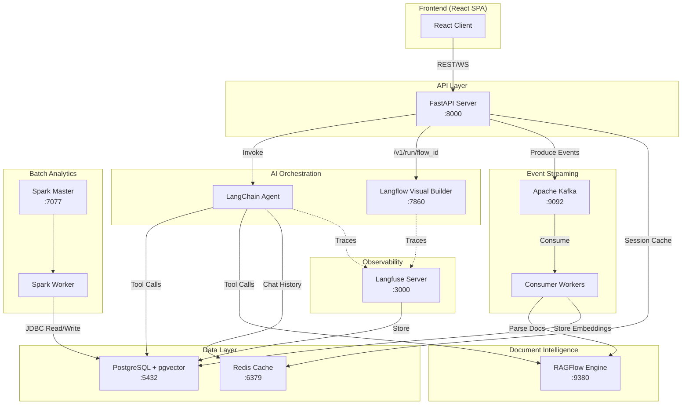

# System Topology — EchoMind Core

## Architecture Overview

## Service Topology

| Service | Container Name | Image | Port | Depends On |
|---|---|---|---|---|
| FastAPI App | echomind-app | Custom Dockerfile | 8000 | postgres, redis, kafka |
| PostgreSQL | echomind-postgres | pgvector/pgvector:pg16 | 5432 | — |
| Redis | echomind-redis | redis:7-alpine | 6379 | — |
| Kafka | echomind-kafka | bitnami/kafka:3.7 | 9092 | — |
| Langfuse | echomind-langfuse | langfuse/langfuse:2 | 3000 | postgres |
| Langflow | echomind-langflow | langflowai/langflow:latest | 7860 | postgres |
| RAGFlow | echomind-ragflow | infiniflow/ragflow:latest | 9380 | — |
| Spark Master | echomind-spark-master | bitnami/spark:3.5 | 8080, 7077 | — |
| Spark Worker | echomind-spark-worker | bitnami/spark:3.5 | — | spark-master |

## Network

All services communicate on the `echomind-net` Docker bridge network.
