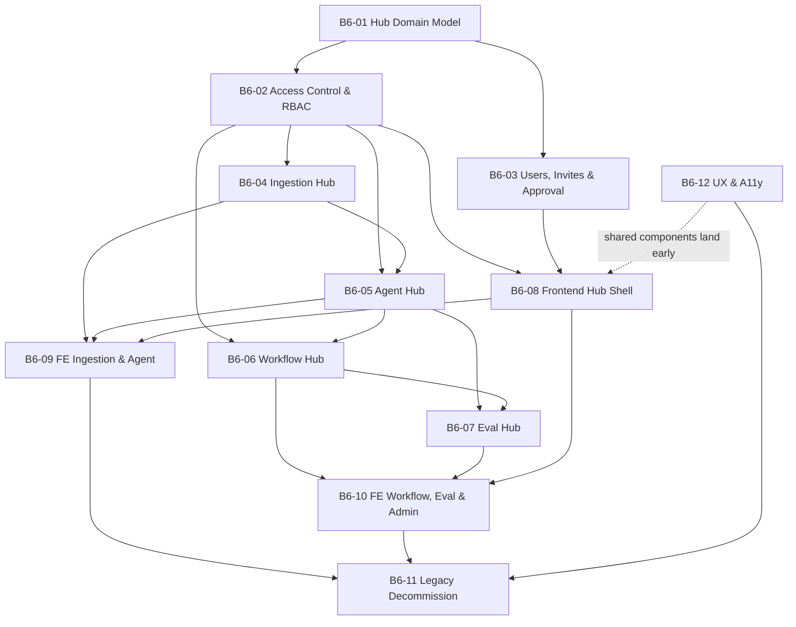

# V6 Task Registry — The Hub Platform

> **Version:** 6
> **Status:** `[ ] In Progress`
> **Goal:** [`goal/goal.md`](file:///c:/Akshat/ContAIned/agent_buildable_base/tasks/v6/goal/goal.md)
> **Canonical design:** [`references/logic/hubs.md`](file:///c:/Akshat/ContAIned/agent_buildable_base/references/logic/hubs.md)

---

## 1. Scope

V6 restructures ContAIned from a flat, single-workspace platform into a **hub-organised, multi-tenant**
platform. Four base hub types — **Ingestion**, **Agent**, **Workflow**, **Eval** — become the entry
point for everything. The Workflow Hub gains true multi-workflow authoring with versioning, and
administrators gain full user lifecycle control through invitations and an approval gate.

This is a **hard cutover**: legacy flat routes, components, columns and store fields are deleted in the
same version that replaces them, and the deletion is verified by `B6-11`.

---

## 2. Base Task Index

| ID | Title | Owner | Complexity | Subtasks | Status |
|---|---|---|---|---|---|
| [B6-01](file:///c:/Akshat/ContAIned/agent_buildable_base/tasks/v6/base/B6-01_hub_domain_model_tenancy.md) | Hub Domain Model & Tenancy Foundation | `common/models`, `migrations` | 🔴 High | 6 | `[x]` |
| [B6-02](file:///c:/Akshat/ContAIned/agent_buildable_base/tasks/v6/base/B6-02_hub_access_control_rbac.md) | Hub Access Control, Scoping & RBAC v2 | `gateway/auth` | 🔴 High | 5 | `[x]` |
| [B6-03](file:///c:/Akshat/ContAIned/agent_buildable_base/tasks/v6/base/B6-03_admin_user_management_invites.md) | Admin User Management, Invitations & Approval Gate | `gateway/auth`, `gateway/api` | 🔴 High | 7 | `[x]` |

| [B6-04](file:///c:/Akshat/ContAIned/agent_buildable_base/tasks/v6/base/B6-04_ingestion_hub_collections_datastores.md) | Ingestion Hub — Collections & Datastore Bindings | `projects/syntraflow` | 🔴 High | 6 | `[x]` |
| [B6-05](file:///c:/Akshat/ContAIned/agent_buildable_base/tasks/v6/base/B6-05_agent_hub_scoped_lifecycle.md) | Agent Hub — Scoped Agent Lifecycle | `projects/guardroute` | 🟡 Medium | 5 | `[ ]` |
| [B6-06](file:///c:/Akshat/ContAIned/agent_buildable_base/tasks/v6/base/B6-06_workflow_hub_multi_workflow.md) | Workflow Hub — Multi-Workflow Management & Versioning | `projects/guardroute` | 🔴 High | 7 | `[ ]` |
| [B6-07](file:///c:/Akshat/ContAIned/agent_buildable_base/tasks/v6/base/B6-07_eval_hub_polymorphic_targets.md) | Eval Hub — Polymorphic Targets & Flow Tracing | `projects/evalops` | 🔴 High | 6 | `[ ]` |
| [B6-08](file:///c:/Akshat/ContAIned/agent_buildable_base/tasks/v6/base/B6-08_frontend_hub_shell_navigation.md) | Frontend — Hub Shell, IA & Navigation | `frontend/src` | 🔴 High | 6 | `[ ]` |
| [B6-09](file:///c:/Akshat/ContAIned/agent_buildable_base/tasks/v6/base/B6-09_frontend_ingestion_agent_workspaces.md) | Frontend — Ingestion & Agent Hub Workspaces | `frontend/src` | 🔴 High | 5 | `[ ]` |
| [B6-10](file:///c:/Akshat/ContAIned/agent_buildable_base/tasks/v6/base/B6-10_frontend_workflow_eval_admin.md) | Frontend — Workflow & Eval Workspaces + Admin Console | `frontend/src` | 🔴 High | 6 | `[ ]` |
| [B6-11](file:///c:/Akshat/ContAIned/agent_buildable_base/tasks/v6/base/B6-11_legacy_decommission_verification.md) | Legacy Decommission, Data Migration & Verification | all modules | 🔴 High | 6 | `[ ]` |
| [B6-12](file:///c:/Akshat/ContAIned/agent_buildable_base/tasks/v6/base/B6-12_ux_interaction_accessibility.md) | UX, Interaction & Accessibility Uplift | `frontend/src` | 🟡 Medium | 6 | `[ ]` |

**Total: 12 Base Tasks, 71 Subtasks.**

---

## 3. Execution Order & Dependency Graph



### Recommended wave sequencing

| Wave | Tasks | Rationale |
|---|---|---|
| **1** | `B6-01` | Nothing else can start; the schema is the contract. |
| **2** | `B6-02`, `B6-03`, `B6-12a`–`B6-12b` | Access control and user lifecycle in parallel; shared UI components land early so hub workspaces consume them. |
| **3** | `B6-04`, `B6-08` | Ingestion backend and the frontend shell can proceed independently. |
| **4** | `B6-05`, `B6-09` | Agent Hub needs Ingestion for collection bindings; its UI needs the shell. |
| **5** | `B6-06` | Workflow Hub needs the Agent Hub for qualified agent references. |
| **6** | `B6-07`, `B6-10` | Eval Hub needs both agent and workflow targets. |
| **7** | `B6-12c`–`B6-12f` | Polish pass once every surface exists. |
| **8** | `B6-11` | Removal and verification last, when replacements are proven. |

---

## 4. Cross-Cutting Rules for V6 Execution Agents

1. **Read [`hubs.md`](file:///c:/Akshat/ContAIned/agent_buildable_base/references/logic/hubs.md) first.**
   It is canonical. If a subtask conflicts with it, the subtask is wrong — log the conflict in
   [`temp/`](file:///c:/Akshat/ContAIned/agent_buildable_base/tasks/v6/temp) and ask.
2. **Never query a hub-scoped model by primary key alone.** Every read includes `hub_id`. This is a
   security requirement, not a style preference.
3. **Never leak hub existence.** Non-members get `404`, never `403`.
4. **Delete as you replace.** A subtask that introduces a hub-scoped route is not complete while its
   flat predecessor still answers.
5. **Every mutating hub or admin endpoint writes one `audit_log` row.**
6. **Migrations are two-stage, reversible and idempotent.** Never squash stage 1 and stage 2.
7. **Role-gate the UI, not just the API.** A `viewer` should never see a control that will fail.
8. **Update references as you go.** If your change contradicts a document under `references/`, fix the
   document in the same subtask.

---

## 5. Directory Layout

```text
tasks/v6/
├── tasks.md      # this file — V6 registry, dependency graph, execution rules
├── goal/
│   └── goal.md   # North Star for V6
├── base/         # B6-01 … B6-12 — architectural milestones
├── sub/          # S6-01a … S6-12f — 71 granular execution units
└── temp/         # ad-hoc out-of-scope findings discovered mid-execution
```
