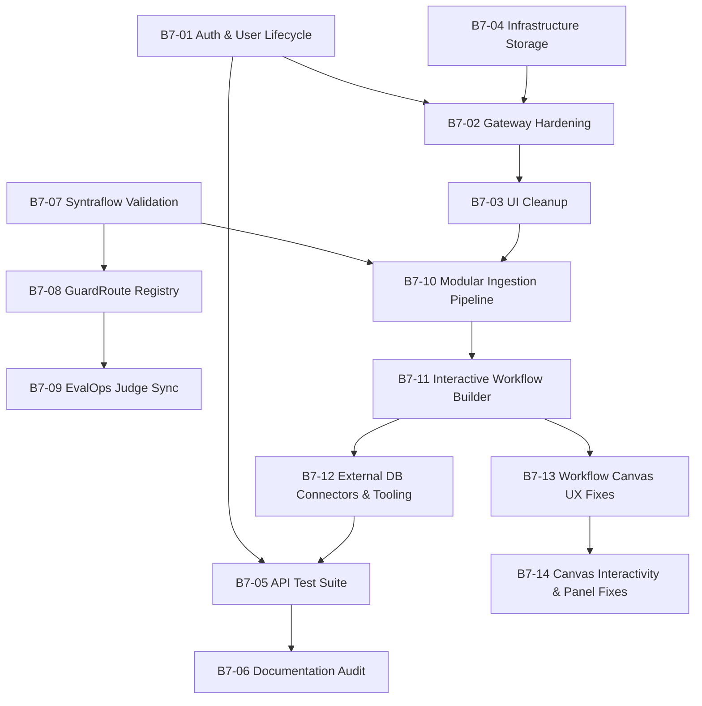

# V7 Task Registry — Platform Stabilization & Lifecycle

> **Version:** 7
> **Status:** `[x] Completed`
> **Goal:** [`goal/v7_goal.md`](file:///c:/Akshat/ContAIned/agent_buildable_base/tasks/v7/goal/v7_goal.md)
> **Canonical design:** [`references/structure/system_architecture.md`](file:///c:/Akshat/ContAIned/agent_buildable_base/references/structure/system_architecture.md)

---

## 1. Scope

Version 7 executes a comprehensive platform stabilization cycle across the monorepo. It completes the user authentication lifecycle (soft/hard deletion, secure logout session revocation, `.env` super admin bootstrapping), hardens Gateway APIs (fail-fast error handling, accurate health monitoring, JSON error formatting), aligns persistent infrastructure storage to local host paths (`./data/*`), delivers clean startup UI empty-states, adds a comprehensive API test suite, and updates all canonical system reference documentation.

---

## 2. Base Task Index

| ID | Title | Owner | Complexity | Subtasks | Status |
|---|---|---|---|---|---|
| [B7-01](file:///c:/Akshat/ContAIned/agent_buildable_base/tasks/v7/base/01_auth_lifecycle.md) | Auth & User Lifecycle Management | `gateway/auth`, `common/models` | 🔴 High | 5 | `[x]` |
| [B7-02](file:///c:/Akshat/ContAIned/agent_buildable_base/tasks/v7/base/02_gateway_hardening.md) | Gateway Hardening & Error Visibility | `gateway/api` | 🟡 Medium | 4 | `[x]` |
| [B7-03](file:///c:/Akshat/ContAIned/agent_buildable_base/tasks/v7/base/03_ui_cleanup.md) | UI Cleanup, Empty States & Infrastructure UI | `frontend/src` | 🟡 Medium | 3 | `[x]` |
| [B7-04](file:///c:/Akshat/ContAIned/agent_buildable_base/tasks/v7/base/04_infra_storage.md) | Infrastructure & Persistent Storage Alignment | `infrastructure` | 🟢 Low | 1 | `[x]` |
| [B7-05](file:///c:/Akshat/ContAIned/agent_buildable_base/tasks/v7/base/05_api_test_suite.md) | Comprehensive Gateway API Test Suite | `tests/` | 🟡 Medium | 1 | `[x]` |
| [B7-06](file:///c:/Akshat/ContAIned/agent_buildable_base/tasks/v7/base/06_references_update.md) | System Reference Documentation Audit | `references/` | 🟢 Low | 1 | `[x]` |
| [B7-07](file:///c:/Akshat/ContAIned/agent_buildable_base/tasks/v7/base/07_syntraflow_updates.md) | Syntraflow Stabilizations & Datastore Validation | `projects/syntraflow` | 🟡 Medium | 4 | `[x]` |
| [B7-08](file:///c:/Akshat/ContAIned/agent_buildable_base/tasks/v7/base/08_guardroute_updates.md) | GuardRoute Model Registry & Key Awareness | `projects/guardroute` | 🟡 Medium | 4 | `[x]` |
| [B7-09](file:///c:/Akshat/ContAIned/agent_buildable_base/tasks/v7/base/09_evalops_updates.md) | EvalOps Judge Sync & Error Boundaries | `projects/evalops` | 🟡 Medium | 2 | `[x]` |
| [B7-10](file:///c:/Akshat/ContAIned/agent_buildable_base/tasks/v7/base/10_modular_ingestion_pipeline.md) | Modular Configurable Ingestion Pipeline & UX | `projects/syntraflow`, `gateway`, `frontend` | 🔴 High | 2 | `[x]` |
| [B7-11](file:///c:/Akshat/ContAIned/agent_buildable_base/tasks/v7/base/11_interactive_visual_workflow_builder.md) | Interactive Visual Workflow Builder & Hub Integrations | `common/models`, `projects/guardroute`, `gateway`, `frontend` | 🔴 High | 4 | `[/]` |
| [B7-12](file:///c:/Akshat/ContAIned/agent_buildable_base/tasks/v7/base/12_external_database_connectors_and_tooling.md) | External Database Connectors & Database Tooling Nodes | `common/clients`, `common/security`, `gateway`, `frontend` | 🔴 High | 4 | `[/]` |
| [B7-13](file:///c:/Akshat/ContAIned/agent_buildable_base/tasks/v7/base/13_workflow_canvas_fixes.md) | Workflow Canvas UX Fixes — Defaults, Draft Persistence, Cross-Hub Links & Links Panel | `frontend/src/components/hubs/workflow`, `frontend/src/services` | 🟡 Medium | 4 | `[x]` |
| [B7-14](file:///c:/Akshat/ContAIned/agent_buildable_base/tasks/v7/base/14_workflow_canvas_interactivity_and_panel_fixes.md) | Workflow Canvas Interactivity, Loading States & Hub Panel Fixes | `frontend/src/components/hubs/workflow`, `frontend/src/components/hubs`, `gateway/api`, `common/services` | 🟡 Medium | 5 | `[ ]` |
| [B7-15](file:///c:/Akshat/ContAIned/agent_buildable_base/tasks/v7/base/15_agent_tools_architecture.md) | Agent Tools Architecture — Remove Standalone Tool Nodes | `common/schemas`, `projects/guardroute`, `frontend/src/components/hubs/workflow`, `frontend/src/components/nodes` | 🔴 High | 1 | `[x]` |

**Total: 15 Base Tasks, 45 Subtasks.**

---

## 3. Execution Order & Dependency Graph



### Recommended Wave Sequencing

| Wave | Tasks | Rationale |
|---|---|---|
| **1** | `B7-01`, `B7-04` | Database schema (soft delete) & local host path storage land first. |
| **2** | `B7-02`, `B7-07` | Gateway error handling & Syntraflow datastore validation. |
| **3** | `B7-03`, `B7-08` | Frontend empty states & GuardRoute dynamic model registry key awareness. |
| **4** | `B7-09` | EvalOps judge model sync dependent on GuardRoute model registry. |
| **5** | `B7-10` | Modular Configurable Ingestion Pipeline & UI UX overhaul. |
| **6** | `B7-11` | Interactive Visual Workflow Builder & Multi-Hub Node Integrations. |
| **7** | `B7-12` | External Database Connectors, Dynamic MCP DB Tools & DB Query Nodes. |
| **8** | `B7-13` | Workflow Canvas UX Fixes — defaults, draft persistence, cross-hub links, links panel. |
| **9** | `B7-14` | Canvas interactivity (pan/zoom/shortcuts/fullscreen), dropdown loading states, Members & Links panel fixes. |
| **10** | `B7-05` | Comprehensive Gateway API tests run after all API changes land. |
| **11** | `B7-06` | Final documentation audit to verify system memory consistency. |

---

## 4. Cross-Cutting Rules for V7 Execution Agents

1. **No silent fallbacks.** If a service or database fails, the Gateway must return a structured JSON error response (`503` or `500`), never mock fallback data.
2. **Soft deletion by default.** All database reads for `User` or `Hub` models must filter out soft-deleted entities (`is_deleted == False`).
3. **Session revocation.** Account logout (`POST /auth/logout`) or deletion must invalidate all active user sessions immediately.
4. **Host path persistence.** Docker compose persistence must use local host directories (`./data/*`), not named volumes.
5. **Always update references.** Every structural or logic change must be documented in `agent_buildable_base/references/`.

---

## 5. Directory Layout

```text
tasks/v7/
├── tasks.md      # V7 registry, dependency graph, execution rules (this file)
├── goal/
│   └── v7_goal.md # North Star for V7
├── base/         # B7-01 … B7-09 — architectural milestones
├── sub/          # Granular execution units
└── temp/         # ad-hoc out-of-scope findings
```
