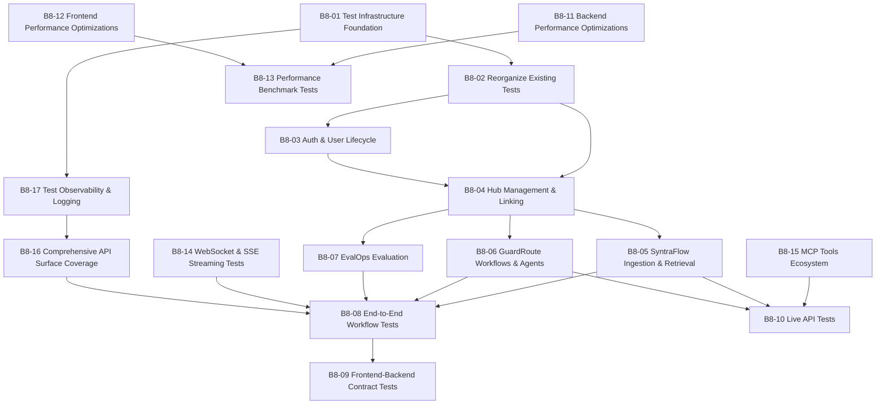

# V8 Task Registry — Real-World Test Suite & System Optimization

> **Version:** 8
> **Status:** `[ ] Active`
> **Goal:** [`goal/v8_goal.md`](file:///c:/Akshat/ContAIned/agent_buildable_base/tasks/v8/goal/v8_goal.md)
> **Canonical design:** [`references/structure/system_architecture.md`](file:///c:/Akshat/ContAIned/agent_buildable_base/references/structure/system_architecture.md)

---

## 1. Scope

Version 8 replaces the current mock-heavy, in-memory-only test suite with a layered testing infrastructure that hits **actual running services & standard ports** (Postgres `:5432`, Qdrant `:6333`, Redis `:6379`, Neo4j `:7687`, Kafka `:9092`, Gateway `:8000`, Inference `:8001`), validates full frontend-to-backend data flows, tests all WebSocket/SSE streaming interactions, and exposes real-world bugs. 

**Core Principles for V8 Execution:**
- **Full-Stack Bug Remediation:** When tests uncover errors or flaws, engineers/agents are mandated to diagnose and fix the root causes in the backend (FastAPI gateway, services, models), frontend (API clients, state stores, UI), inference engine, or submodules (SyntraFlow, GuardRoute, EvalOps, Common Library) to make tests pass cleanly.
- **Docker Container Log Inspection:** When tests fail, inspect **Docker container logs** (`docker compose logs <service>`) to pinpoint backend infrastructure issues.
- **Actual Services & Ports:** Do not create separate test containers or divergent ports. Use the actual running development services.
- **No Mandatory Test Data Deletion:** Deleting data created during tests is not necessary; unique namespaces and UUIDs are used to avoid test interference.

Simultaneously, V8 optimizes the backend and frontend for performance, deduplication, and caching, and establishes a user-facing MCP tools ecosystem.

---

## 2. Base Task Index

| ID | Title | Owner | Complexity | Subtasks | Status |
|---|---|---|---|---|---|
| [B8-01](file:///c:/Akshat/ContAIned/agent_buildable_base/tasks/v8/base/01_test_infrastructure_foundation.md) | Test Infrastructure & Configuration Foundation | `tests/`, `infrastructure`, `common/config` | 🔴 High | 4 | `[x]` |
| [B8-02](file:///c:/Akshat/ContAIned/agent_buildable_base/tasks/v8/base/02_reorganize_existing_tests.md) | Reorganize & Classify Existing Tests | `tests/` | 🟡 Medium | 3 | `[x]` |
| [B8-03](file:///c:/Akshat/ContAIned/agent_buildable_base/tasks/v8/base/03_auth_user_lifecycle_real.md) | Real-World Integration Tests — Auth & User Lifecycle | `tests/integration/gateway`, `gateway/auth` | 🔴 High | 3 | `[x]` |
| [B8-04](file:///c:/Akshat/ContAIned/agent_buildable_base/tasks/v8/base/04_hub_management_linking_real.md) | Real-World Integration Tests — Hub Management & Linking | `tests/integration/gateway`, `gateway/api`, `common/services` | 🔴 High | 4 | `[x]` |
| [B8-05](file:///c:/Akshat/ContAIned/agent_buildable_base/tasks/v8/base/05_syntraflow_ingestion_retrieval_real.md) | Real-World Integration Tests — SyntraFlow (Ingestion & Retrieval) | `tests/integration/syntraflow`, `projects/syntraflow` | 🔴 High | 3 | `[/]` *(12 tests pass; API embedder + OCR paths blocked by infra)* |
| [B8-06](file:///c:/Akshat/ContAIned/agent_buildable_base/tasks/v8/base/06_guardroute_workflows_agents_real.md) | Real-World Integration Tests — GuardRoute (Workflows & Agents) | `tests/integration/guardroute`, `projects/guardroute` | 🔴 High | 4 | `[ ]` |
| [B8-07](file:///c:/Akshat/ContAIned/agent_buildable_base/tasks/v8/base/07_evalops_evaluation_real.md) | Real-World Integration Tests — EvalOps (Evaluation Pipelines) | `tests/integration/evalops`, `projects/evalops` | 🔴 High | 3 | `[ ]` |
| [B8-08](file:///c:/Akshat/ContAIned/agent_buildable_base/tasks/v8/base/08_end_to_end_workflow_tests.md) | End-to-End Workflow Tests (Full User Journeys) | `tests/e2e/flows` | 🔴 High | 4 | `[ ]` |
| [B8-09](file:///c:/Akshat/ContAIned/agent_buildable_base/tasks/v8/base/09_frontend_backend_contract_tests.md) | Frontend-Backend Contract Tests | `tests/e2e/contracts`, `scripts`, `frontend/src` | 🟡 Medium | 3 | `[ ]` |
| [B8-10](file:///c:/Akshat/ContAIned/agent_buildable_base/tasks/v8/base/10_live_api_tests.md) | Live API Tests (External Service Integration) | `tests/live_api`, `gateway`, `mcp_tools` | 🔴 High | 4 | `[ ]` |
| [B8-11](file:///c:/Akshat/ContAIned/agent_buildable_base/tasks/v8/base/11_backend_performance_optimizations.md) | Backend Performance Optimizations | `gateway`, `common/services`, `common/clients` | 🔴 High | 4 | `[ ]` |
| [B8-12](file:///c:/Akshat/ContAIned/agent_buildable_base/tasks/v8/base/12_frontend_performance_optimizations.md) | Frontend Performance Optimizations | `frontend/src` | 🟡 Medium | 4 | `[ ]` |
| [B8-13](file:///c:/Akshat/ContAIned/agent_buildable_base/tasks/v8/base/13_performance_benchmark_tests.md) | Performance Benchmark Tests | `tests/performance` | 🟡 Medium | 3 | `[ ]` |
| [B8-14](file:///c:/Akshat/ContAIned/agent_buildable_base/tasks/v8/base/14_websocket_sse_streaming_tests.md) | WebSocket & SSE Streaming Tests | `tests/streaming`, `gateway/api` | 🔴 High | 6 | `[ ]` |
| [B8-15](file:///c:/Akshat/ContAIned/agent_buildable_base/tasks/v8/base/15_mcp_tools_ecosystem.md) | MCP Tools Ecosystem & User-Facing Tool Registry | `mcp_tools/`, `tests/integration` | 🟡 Medium | 3 | `[ ]` |
| [B8-16](file:///c:/Akshat/ContAIned/agent_buildable_base/tasks/v8/base/16_comprehensive_api_surface_coverage.md) | Comprehensive API Surface Coverage | `tests/integration/gateway`, `scripts` | 🔴 High | 7 | `[ ]` |
| [B8-17](file:///c:/Akshat/ContAIned/agent_buildable_base/tasks/v8/base/17_test_observability_logging.md) | Test Observability & Logging Infrastructure | `tests/conftest.py`, `scripts` | 🟡 Medium | 4 | `[x]` |


**Total: 17 Base Tasks, 66 Subtasks.**

---

## 3. Execution Order & Dependency Graph



### Recommended Wave Sequencing

| Wave | Tasks | Rationale |
|---|---|---|
| **1** | `B8-01`, `B8-02` | Test infrastructure foundation and existing-test reorganization land first. |
| **2** | `B8-17` | Observability/logging plugin so all subsequent test runs produce diagnostics. |
| **3** | `B8-03`, `B8-04` | Auth/user lifecycle and hub management integration tests against real Postgres. |
| **4** | `B8-05`, `B8-06`, `B8-07` | SyntraFlow, GuardRoute, and EvalOps integration tests against real services. |
| **5** | `B8-15` | MCP tools ecosystem (sample servers) — prerequisite for live MCP tests. |
| **6** | `B8-14` | WebSocket & SSE streaming tests against running gateway with real Redis pub/sub. |
| **7** | `B8-08` | End-to-end workflow tests (full user journeys) after all integration layers pass. |
| **8** | `B8-09`, `B8-16` | Frontend-backend contract tests and comprehensive API surface coverage. |
| **9** | `B8-10` | Live API tests (requires real API keys in `.env.test`). |
| **10** | `B8-11`, `B8-12` | Backend and frontend performance optimizations. |
| **11** | `B8-13` | Performance benchmark tests codify the optimization expectations. |

---

## 4. Cross-Cutting Rules for V8 Execution Agents

1. **Actual services and standard ports, not separate containers or mock-only bypasses.** Integration, streaming, E2E, and live API tests must connect to actual running services on standard ports (Postgres `:5432`, Qdrant `:6333`, Redis `:6379`, Neo4j `:7687`, Kafka `:9092`, Gateway `:8000`, Inference `:8001`). Do NOT spin up separate test container stacks with divergent ports.
2. **Fix root-cause flaws across the entire stack.** When tests encounter errors, failures, or schema discrepancies, do not merely skip tests or assert around broken behavior. Investigate and actively **fix the underlying backend, frontend, inference engine, or submodule code** (e.g., `projects/syntraflow`, `projects/guardroute`, `projects/evalops`, `common/`, `gateway/`, `frontend/`).
3. **Inspect Docker container logs on test failures.** When tests fail, execute `docker compose logs <service>` or `docker logs <container>` to examine container-side error traces (Postgres, Qdrant, Neo4j, Redis, Kafka) alongside pytest traces.
4. **Deleting test data is not necessary.** Test data persistence is acceptable. Use unique identifiers (UUIDs, prefixed slugs) for test entity isolation rather than mandating aggressive post-test deletion or database purging.
5. **Test model configuration.** All LLM-dependent tests use API-based models via Google Gemini API key (`GOOGLE_API_KEY` in `.env.test`). No local completion/chat models in tests. Use `gemini/gemini-3.5-flash` for workflow/playground/eval, `gemini/gemma-3-27b-it` for agent-creation tests, `gemini/gemini-embedding-2` for API embedding, `microsoft/harrier-oss-v1-0.6b` (1,024-dim) and `microsoft/harrier-oss-v1-270m` (640-dim) for local text embedding, `jinaai/jina-clip-v2` (1,024-dim) for local multimodal embedding, and `gemini/gemini-3.5-flash` as `DEEPEVAL_MODEL`. Compatibility aliases such as `harrier-0.6b` may be accepted by tests only when they resolve to the canonical repository ID.
6. **Markers are mandatory.** Every test file must carry the correct `@pytest.mark.*` marker (`unit`, `integration`, `e2e`, `live_api`, `streaming`, `performance`). `--strict-markers` is enforced.
7. **No breaking currently-passing tests.** Reorganization (B8-02) must reproduce today's pass/fail exactly.
8. **Always update references.** Every structural or logic change must be documented in `agent_buildable_base/references/`.

---

## 5. Directory Layout

```text
tasks/v8/
├── tasks.md      # V8 registry, dependency graph, execution rules (this file)
├── goal/
│   └── v8_goal.md # North Star for V8
├── base/         # B8-01 … B8-17 — architectural milestones
├── sub/          # Granular execution units
└── temp/         # ad-hoc out-of-scope findings
```
