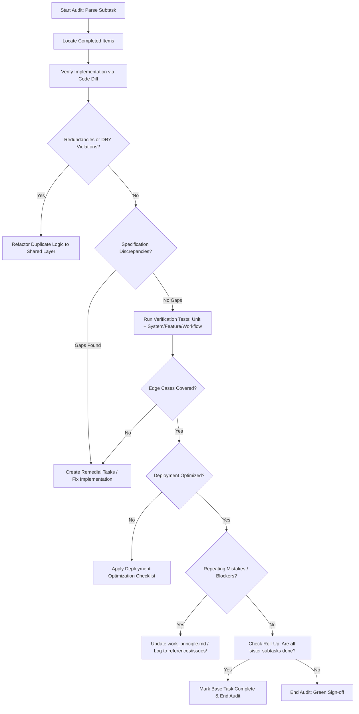

# Standard Operating Procedure: Task Verification & Auditing (`work_verification.md`)

This document defines the official verification, audit, and quality assurance
protocol for all agents and developers. It ensures systemic integrity,
eliminates redundancies, and enforces strict execution standards by heavily
cross-referencing the rules defined in `../../tasks/tasks.md`,
`../../references/references.md`, and `../../CONVENTIONS.md`.

---

## 1. Architectural Verification Priorities

During any audit cycle, verification must be executed in the following
hierarchical order of importance:

### I. AI & Core Services Validation
- **Inference Integrity:** Verify that LLM orchestration, model clients, and
  inference pipelines strictly adhere to the designated prompt structures and
  output schemas.
- **Evaluation & Guardrails:** Ensure that benchmarking tests and safety checks
  pass successfully for any new AI feature or agent logic.
- **Context & Token Optimization:** Confirm that context windows are managed
  efficiently, preventing state leakage and optimizing latency for all AI
  service calls.

### II. Backend & Infrastructure Validation
- **Data Schemas & Type Safety:** Validate that all backend models are strictly
  typed and accurately reflect the architectural intent, and that schema,
  models, and migrations are in sync (see `../../references/db/`).
- **System Resiliency:** Verify that API routes, message brokers, and database
  connection pools include proper error handling and retry logic — **without**
  blanket `try/except` or hard pre-created fallbacks (see
  `../quality/fallback_policy.md`).
- **Containerization & Deployment:** Ensure that Dockerfiles, container
  orchestrations, and dependency managers successfully build the updated
  environment **without introducing bloat** — apply the deployment optimization
  checklist (see `../../references/deployment/optimization_checklist.md`).

---

## 2. Audit Trigger & Scope

**Trigger:** Verification is mandatory whenever a Subtask is marked as completed
(`[x]`) in the `tasks/sub/` directory.

1. **Identify the Target Perimeter:** Retrieve the active file changes or git
   commit diff associated with the completed Subtask.
2. **Isolate Execution Assets:** Focus strictly on the structural footprint
   (code, configurations, schemas) introduced by the `[x]` items.

---

## 3. Work Verification Flow

### Step 1: Trace Execution to Specification (Adhere to `../../tasks/tasks.md`)
- Map the active code changes directly to the "Definition of Done" outlined in
  the specific Subtask file.
- **Discrepancy Check:** Look for architectural gaps such as missing validation
  fields, improper log formats, or hardcoded variables that should be
  environment-driven.
- **Roll-Up Check:** If this is the final Subtask, verify all sister Subtasks
  are complete before marking the parent Base Task in `tasks/base/` as `[x]`.

### Step 2: Redundancy & Core DRY Audit
- Scan for duplicate code patterns that violate modular workspace principles.
- If duplicate helper functions, AI clients, or data models are found,
  immediately refactor them into a centralized `common/` or shared reference
  package.
- **Duplicate-name check:** verify no `if`/`or`/`and` conditions use
  similar-but-duplicate names; fix the root source and unify (see
  `../../CONVENTIONS.md` §3).
- Update all dependent submodules to import from this unified layer.

### Step 3: Test Execution
- Run the designated test suites. **Both tracks must pass**: unit tests AND real
  system interaction / feature & workflow tests (see `../../references/tests/`).
- **Edge cases** listed in the subtask must each have a passing test.
- AI evaluation checks pass first, followed by unit and integration tests.

### Step 4: Logging & Bloat Audit
- Verify logs are structured, findable, and not bloated (see
  `../../references/logs/`).
- Remove or downgrade noisy warnings; do not leave log bloat in runs.

### Step 5: Systemic Feedback Loop (Adhere to `../../references/references.md`)
- **Log Technical Debt:** If architectural flaws, deprecated dependencies, or
  technical blockers are discovered during the audit, log a detailed report in
  `references/issues/` so future execution agents are aware.
- **Evolve the Baseline:** If an architectural oversight or anti-pattern is
  repeatedly discovered, instantly update `work_principle.md` and
  `../../CODING_PHILOSOPHY.md` to prevent future occurrences and evolve the
  system's baseline intelligence.

---

## 4. Tool Reference Checklist

Below are the standard capabilities expected to be utilized during the
verification flow:

| Audit Action | Target Action | Description / Operational Intent |
|---|---|---|
| **Trace Code & References** | Global Symbol Search | Scan for usage of environment fields, core AI clients, or specific models across the codebase to ensure consistency. |
| **Locate Checklist Progress** | Workspace Text Grep | Search the `tasks/` directory for updated `\[x\]` tags to map out the current verification perimeter. |
| **Static Code Inspection** | File Content Review | Review logic blocks for proper type definitions, validations, and telemetry integration. |
| **Analyze Active Changes** | Version Control Diff | Execute diff commands (e.g., `git diff`) to isolate what changed in the workspace compared to the baseline branch. |
| **Verify Test Quality** | Environment Test Execution | Run the workspace's designated test frameworks to guarantee both AI reliability and backend system health. |
| **Verify Tooling** | Lint / Format / Typecheck | Run the recorded linter, formatter, and type-checker (see `../../STACK.md`). |
| **Verify Deployment** | Image / Build Check | Confirm deployment files are optimized (see `../../references/deployment/optimization_checklist.md`). |
