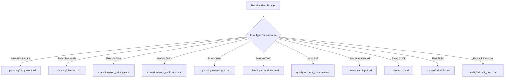

# Workflow Router — Task Classification & Routing

> **Purpose**: The first workflow that models check. This router reads the user
> prompt and determines which workflow(s) are best suited for the task. It is
> loaded alongside `../agent.md` (the always-loaded base) on every interaction.

## 1. Task Classification Decision Tree



## 2. Classification Mapping

| Task Pattern | Primary Workflow | Supporting Workflows |
|---|---|---|
| "Start a new project" / "Initialize" / "Setup" | `planning/init_project.md` | `user/user_input.md` |
| "Research" / "Plan" / "Options" / "Recommend" | `planning/planning.md` | `user/user_input.md` |
| "Execute" / "Implement" / "Build" / "Work" | `execution/work_principle.md` | `planning/planning.md` (first) |
| "Verify" / "Audit" / "Test" / "Check" | `execution/work_verification.md` | (standalone) |
| "Expand" / "Deepen" a goal | `planning/extend_goal.md` | `user/user_input.md` |
| "Expand" / "Deepen" a task | `planning/extend_task.md` | `user/user_input.md` |
| "Audit" / "Drift check" / "Recheck" | `quality/recheck_codebase.md` | `execution/work_verification.md` |
| "Ask user" / "Need input" / "Conditioning" | `user/user_input.md` | (standalone or upstream) |
| "Setup GitHub Actions" / "CI/CD" | `ci/setup_ci.md` | `planning/planning.md` (first) |
| "Find" / "Discover" skills online | `user/find_skills.md` | `planning/planning.md` (research) |
| "Fallback" / "Error handling" question | `quality/fallback_policy.md` | `user/user_input.md` |

## 3. Routing Logic

1. **Receive** the user prompt.
2. **Classify** the task type using the decision tree above.
3. **Inspect Skills**: Check `../skills/skills.md` to find available skills matching the task (e.g. `practice/tdd`, `practice/verification_before_completion`, `ui/frontend_design`). Adopt the relevant skill rules.
4. **Route** to the primary workflow.
5. **Load** supporting workflows and references (`../references/`).
6. **Execute** in order (respecting dependencies).

## 4. Example Flows

### Flow A: Execute a New Feature
```
User: "Build authentication system"
→ Router classifies as "Execute + Plan"
→ Load: planning/planning.md (research first)
→ Load: planning/extend_goal.md (clarify scope)
→ Load: user/user_input.md (ask user questions)
→ Load: execution/work_principle.md (execute)
→ Load: execution/work_verification.md (verify)
→ Load: ci/setup_ci.md (optional: setup tests/ci)
```

### Flow B: Audit a Completed Subtask
```
User: "Verify task XYZ is complete"
→ Router classifies as "Verify"
→ Load: execution/work_verification.md (audit)
→ Load: quality/recheck_codebase.md (check for drift)
```

### Flow C: User Needs to Make a Choice
```
User: "Should we support backward compatibility?"
→ Router classifies as "User Input Needed"
→ Load: user/user_input.md (ask + record decision)
→ Load: planning/planning.md (if planning a change)
```

## 5. User Preferences

- Before routing, consult `../USER_PREFERENCES.md` for user-level preferences
  (tools, casing, fallback stance, verbosity) that may affect which workflow or
  how it is executed.
- Project-level overrides live in `../STACK.md`.
