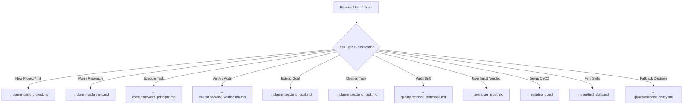

# Workflow Router — Task Classification & Routing

> **Purpose**: The first workflow that models check. This router reads the user
> prompt and determines which workflow(s) are best suited for the task. It is
> loaded alongside `../agent.md` (the always-loaded base) on every interaction.

## 0. Cold-Start Exploration Step
If starting a session without active conversational context or on a fresh prompt turn:
1. First read `../STACK.md`, `../tasks/goal/goal.md`, and `../tasks/tasks.md` to identify active milestone and ready tasks.
2. Formulate subsequent workflow execution with full awareness of current project state.

## 1. Task Classification Decision Tree

## 2. Classification Mapping

| Task Pattern | Primary Workflow | Supporting Workflows |
|---|---|---|
| "Start a new project" / "Initialize" / "Setup" | `planning/init_project.md` | `user/user_input.md` |
| "Research" / "Plan" / "Options" / "Recommend" | `planning/planning.md` | `user/user_input.md` |
| "Execute" / "Implement" / "Build" / "Work" | `execution/work_principle.md` | `planning/planning.md` (first) |
| "Verify" / "Audit" / "Test" / "Check" | `execution/work_verification.md` | (standalone) |
| "Expand" / "Deepen" a goal | `planning/extend_goal.md` | `user/user_input.md` |
| "Expand" / "Deepen" a task | `planning/extend_task.md` | `user/user_input.md` |
| "Audit" / "Drift check" / "Recheck" | `quality/recheck_codebase.md` | `execution/work_verification.md` |
| "Ask user" / "Need input" / "Conditioning" | `user/user_input.md` | (standalone or upstream) |
| "Setup GitHub Actions" / "CI/CD" | `ci/setup_ci.md` | `planning/planning.md` (first) |
| "Find" / "Discover" skills online | `user/find_skills.md` | `planning/planning.md` (research) |
| "Fallback" / "Error handling" question | `quality/fallback_policy.md` | `user/user_input.md` |

## 3. Routing Logic

1. **Assimilate** project state if session is cold-started.
2. **Receive** the user prompt.
3. **Classify** the task type using the decision tree above.
4. **Route** to the primary workflow.
5. **Load** supporting workflows as dependencies.
6. **Execute** in order (respecting dependencies).

## 4. User Preferences

- Before routing, consult `../USER_PREFERENCES.md` for user-level preferences (tools, casing, fallback stance, verbosity) that may affect which workflow or how it is executed.
- Project-level overrides live in `../STACK.md`.
